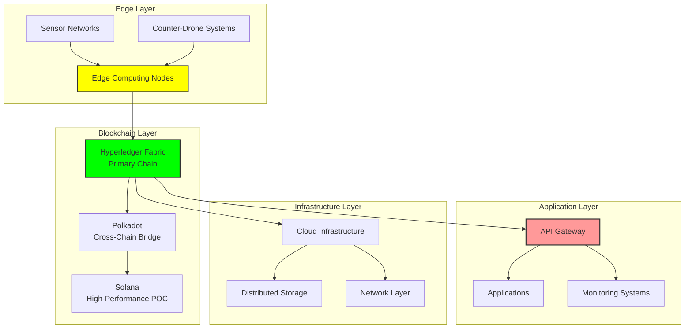

# Blockchain Architecture

## Document Context

- **Location**: `02-technical-architecture/blockchain-architecture.md`
- **Related Documents**:
  - [System Requirements](./system-requirements.md) - Technical specifications
  - [Performance Metrics](./performance-metrics.md) - Performance benchmarks
  - [Hybrid Architecture](./hybrid-architecture.md) - Multi-chain integration

---

## Executive Summary

The Phoenix Rooivalk blockchain architecture implements a hybrid multi-chain
design optimized for counter-drone operations. The architecture combines
Hyperledger Fabric for enterprise-grade permissioned operations with cross-chain
capabilities for interoperability and scalability.

**Key Architecture Principles:**

- Military-grade security with Byzantine fault tolerance
- Real-time performance for counter-drone operations
- Modular design for flexible deployment scenarios
- Quantum-resistant cryptographic foundations
- Edge computing integration for tactical environments

---

## 1. Architecture Overview

### 1.1 High-Level Architecture



### 1.2 Core Components

```yaml
architecture_components:
  primary_blockchain:
    platform: "Hyperledger Fabric v3.0"
    consensus: "PBFT (Practical Byzantine Fault Tolerance)"
    throughput: "3,500+ TPS"
    latency: "< 1 second finality"

  cross_chain_bridge:
    platform: "Polkadot Parachain"
    purpose: "Multi-chain interoperability"
    protocols: ["XCM", "XCMP"]

  edge_computing:
    hardware: "PUF-enabled secure elements"
    processing: "Real-time threat analysis"
    storage: "Local evidence caching"

  api_layer:
    gateway: "Kong Enterprise"
    protocols: ["REST", "GraphQL", "WebSocket"]
    authentication: "mTLS + JWT"
```

---

## 2. Blockchain Network Design

### 2.1 Hyperledger Fabric Configuration

```yaml
fabric_network:
  organizations:
    - name: "PhoenixRooivalkOrg"
      msp_id: "PhoenixRooivalkMSP"
      peers: 4
      orderers: 3

  channels:
    - name: "operations-channel"
      organizations: ["PhoenixRooivalkOrg"]
      endorsement_policy: "AND('PhoenixRooivalkMSP.peer')"

    - name: "evidence-channel"
      organizations: ["PhoenixRooivalkOrg"]
      endorsement_policy: "MAJORITY('PhoenixRooivalkMSP.peer')"

  consensus:
    type: "etcdraft"
    batch_timeout: "2s"
    max_message_count: 500
    absolute_max_bytes: "10MB"
```

### 2.2 Smart Contract Architecture

```yaml
chaincode_architecture:
  evidence_logging:
    language: "Go"
    functions:
      - "LogEvidence"
      - "VerifyEvidence"
      - "GetEvidenceChain"
    storage: "CouchDB state database"

  access_control:
    language: "Go"
    functions:
      - "CreateRole"
      - "AssignRole"
      - "CheckPermission"
    integration: "External LDAP/AD"

  operational_state:
    language: "Go"
    functions:
      - "UpdateSystemState"
      - "GetCurrentState"
      - "RecordIncident"
    real_time: "Event-driven updates"
```

---

## 3. Security Architecture

### 3.1 Cryptographic Framework

```yaml
cryptographic_stack:
  symmetric_encryption:
    algorithm: "AES-256-GCM"
    key_derivation: "PBKDF2"
    usage: "Data encryption at rest"

  asymmetric_encryption:
    algorithm: "RSA-4096 / ECDSA P-384"
    usage: "Digital signatures, key exchange"
    quantum_ready: "CRYSTALS-Dilithium migration path"

  hash_functions:
    primary: "SHA-256"
    merkle_trees: "SHA-256 based"
    usage: "Block hashing, evidence integrity"

  post_quantum:
    signature: "CRYSTALS-Dilithium"
    key_exchange: "CRYSTALS-Kyber"
    timeline: "2025 migration"
```

### 3.2 Identity and Access Management

```yaml
iam_architecture:
  certificate_authority:
    root_ca: "Phoenix Rooivalk Root CA"
    intermediate_ca: "Operational CA"
    certificate_lifecycle: "2 year validity"

  identity_providers:
    - type: "Hardware Security Module"
      usage: "Node identity"
    - type: "PUF (Physical Unclonable Function)"
      usage: "Edge device identity"
    - type: "LDAP/Active Directory"
      usage: "User identity"

  access_control:
    model: "RBAC (Role-Based Access Control)"
    enforcement: "Smart contract level"
    audit: "Complete access logging"
```

---

## 4. Performance Architecture

### 4.1 Scalability Design

```yaml
scalability_metrics:
  horizontal_scaling:
    peer_nodes: "4-20 nodes"
    orderer_nodes: "3-7 nodes"
    geographic_distribution: "Multi-region support"

  vertical_scaling:
    cpu_requirements: "8-32 cores per node"
    memory_requirements: "32-128 GB RAM"
    storage_requirements: "1-10 TB NVMe SSD"

  performance_targets:
    throughput: "3,500+ TPS sustained"
    latency: "< 1 second confirmation"
    availability: "99.9% uptime"
```

### 4.2 Caching and Storage Strategy

```yaml
storage_architecture:
  blockchain_storage:
    type: "Distributed ledger"
    replication: "Full replication across peers"
    retention: "Indefinite (immutable)"

  state_database:
    type: "CouchDB"
    indexing: "Rich queries supported"
    backup: "Continuous replication"

  off_chain_storage:
    type: "IPFS (InterPlanetary File System)"
    usage: "Large evidence files"
    integration: "Hash anchoring on-chain"

  edge_caching:
    type: "Redis Cluster"
    usage: "Real-time data caching"
    ttl: "Configurable per data type"
```

---

## 5. Integration Architecture

### 5.1 API Gateway Design

```yaml
api_gateway:
  platform: "Kong Enterprise"
  features:
    - "Rate limiting"
    - "Authentication/Authorization"
    - "Request/Response transformation"
    - "Analytics and monitoring"

  endpoints:
    rest_api: "https://api.phoenixrooivalk.mil/v2"
    websocket: "wss://api.phoenixrooivalk.mil/v2/ws"
    graphql: "https://api.phoenixrooivalk.mil/v2/graphql"

  security:
    - "mTLS client certificates"
    - "JWT token validation"
    - "IP whitelisting"
    - "DDoS protection"
```

### 5.2 Event-Driven Architecture

```yaml
event_architecture:
  message_broker:
    platform: "Apache Kafka"
    topics:
      - "detection-events"
      - "response-actions"
      - "system-alerts"
      - "audit-logs"

  event_processing:
    stream_processing: "Apache Kafka Streams"
    complex_event_processing: "Apache Flink"
    real_time_analytics: "Apache Spark Streaming"

  integration_patterns:
    - "Event Sourcing"
    - "CQRS (Command Query Responsibility Segregation)"
    - "Saga Pattern for distributed transactions"
```

---

## 6. Deployment Architecture

### 6.1 Container Orchestration

```yaml
kubernetes_architecture:
  cluster_configuration:
    control_plane: "3 master nodes"
    worker_nodes: "6-20 worker nodes"
    networking: "Calico CNI"

  blockchain_deployment:
    peer_pods: "StatefulSet with persistent volumes"
    orderer_pods: "StatefulSet with raft consensus"
    ca_pods: "Deployment with HA configuration"

  monitoring_stack:
    metrics: "Prometheus + Grafana"
    logging: "ELK Stack (Elasticsearch, Logstash, Kibana)"
    tracing: "Jaeger distributed tracing"
```

### 6.2 Multi-Environment Strategy

```yaml
environment_strategy:
  development:
    nodes: "Single node Fabric network"
    resources: "Minimal resource allocation"
    data: "Synthetic test data"

  staging:
    nodes: "3-node Fabric network"
    resources: "Production-like resources"
    data: "Anonymized production data"

  production:
    nodes: "4+ node Fabric network"
    resources: "Full resource allocation"
    data: "Live operational data"
    security: "Full security controls"
```

---

## 7. Disaster Recovery Architecture

### 7.1 Backup Strategy

```yaml
backup_architecture:
  blockchain_backup:
    frequency: "Continuous block replication"
    retention: "7 years minimum"
    encryption: "AES-256 encrypted backups"

  state_backup:
    frequency: "Every 15 minutes"
    retention: "30 days rolling"
    verification: "Automated integrity checks"

  configuration_backup:
    frequency: "On every change"
    versioning: "Git-based configuration management"
    rollback: "Automated rollback procedures"
```

### 7.2 High Availability Design

```yaml
ha_architecture:
  geographic_distribution:
    primary_region: "US-East"
    secondary_region: "US-West"
    tertiary_region: "EU-Central"

  failover_strategy:
    rpo: "< 1 minute (Recovery Point Objective)"
    rto: "< 5 minutes (Recovery Time Objective)"
    automation: "Automated failover with manual override"

  load_balancing:
    api_gateway: "Active-Active across regions"
    blockchain_nodes: "Regional peer distribution"
    database: "Master-slave replication"
```

---

## 8. Monitoring and Observability

### 8.1 Metrics Collection

```yaml
monitoring_architecture:
  blockchain_metrics:
    - "Transaction throughput (TPS)"
    - "Block creation time"
    - "Peer connectivity status"
    - "Consensus performance"

  application_metrics:
    - "API response times"
    - "Error rates"
    - "User authentication success"
    - "Evidence logging rates"

  infrastructure_metrics:
    - "CPU/Memory utilization"
    - "Network bandwidth"
    - "Storage I/O performance"
    - "Container health status"
```

### 8.2 Alerting Strategy

```yaml
alerting_configuration:
  critical_alerts:
    - "Blockchain network partition"
    - "Consensus failure"
    - "Security breach detection"
    - "Data integrity violation"

  warning_alerts:
    - "High transaction latency"
    - "Resource utilization > 80%"
    - "Certificate expiration < 30 days"
    - "Backup failure"

  notification_channels:
    - "PagerDuty for critical alerts"
    - "Slack for warnings"
    - "Email for informational"
    - "SMS for security incidents"
```

---

## Conclusion

The Phoenix Rooivalk blockchain architecture provides a robust, scalable, and
secure foundation for counter-drone operations. The hybrid multi-chain design
ensures optimal performance while maintaining military-grade security
requirements.

**Key Architecture Benefits:**

- **High Performance**: 3,500+ TPS with sub-second finality
- **Military Security**: Byzantine fault tolerance and quantum-resistant
  cryptography
- **Operational Resilience**: Multi-region deployment with automated failover
- **Future-Proof Design**: Modular architecture supporting technology evolution
- **Comprehensive Monitoring**: Full observability across all system components

The architecture supports both current operational requirements and future
expansion scenarios, ensuring long-term viability and return on investment.

---

**Related Documents:**

- [System Requirements](./system-requirements.md) - Technical specifications
- [Performance Metrics](./performance-metrics.md) - Performance benchmarks
- [Hybrid Architecture](./hybrid-architecture.md) - Multi-chain integration

---

_Context improved by Giga AI - Used main overview development guidelines and
blockchain integration system information for accurate architecture
documentation._
