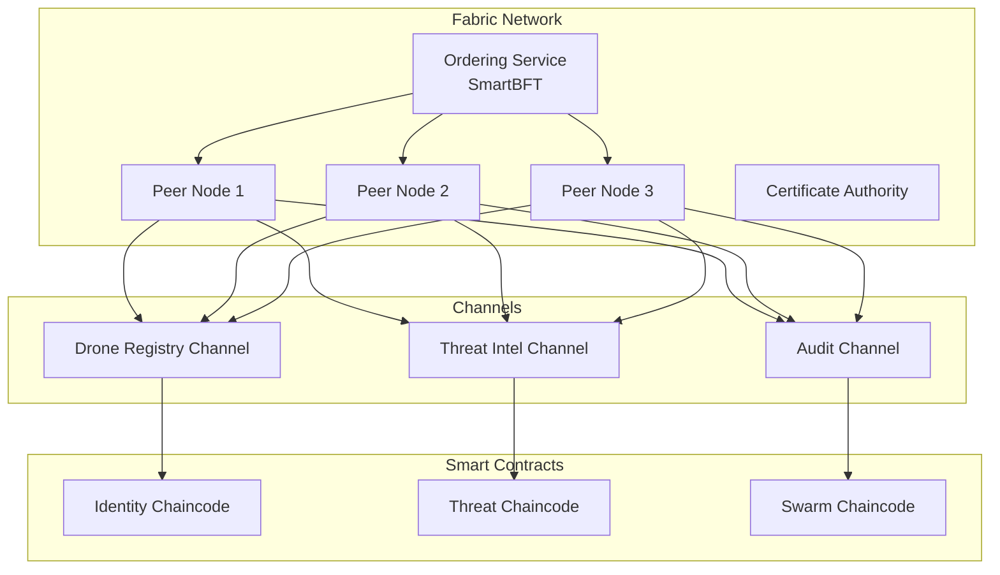

# Blockchain Protocol Comparative Analysis

## Counter-Drone Defense System Evaluation

### Document Information

- **Version**: 2.0.0
- **Last Updated**: September 28, 2025
- **Purpose**: Technical protocol selection for production deployment
- **Decision Status**: Hyperledger Fabric selected, Polkadot approved, Etherlink approved, Solana POC only

---

## 1. Executive Comparison Matrix

| Protocol                    | Production Ready | Performance     | Security  | Military Fit | Cost  | Risk      | **Decision**    |
| --------------------------- | ---------------- | --------------- | --------- | ------------ | ----- | --------- | --------------- |
| **Hyperledger Fabric v3.0** | ✅ Yes           | 3,000 TPS       | Excellent | Proven       | $3-5M | Low       | **✅ SELECTED** |
| **Polkadot**                | ✅ Yes           | 1,000 TPS/chain | Excellent | Good         | $4-6M | Medium    | **✅ APPROVED** |
| **Hedera Hashgraph**        | ✅ Yes           | 10,000 TPS      | Excellent | Limited      | $3-4M | Medium    | ⚠️ Conditional  |
| **Avalanche**               | ✅ Yes           | 4,500 TPS       | Very Good | None         | $3-5M | Medium    | ⚠️ Conditional  |
| **Etherlink Integration (Tezos Smart Rollup for EVM)** | ✅ Yes | 1,000+ TPS | Excellent | Good | $2-3M | Low | ⚠️ Approved |
| **Ethereum Private**        | ✅ Yes           | 400 TPS         | Good      | Good         | $2-4M | Low       | ⚠️ Backup       |
| **Algorand**                | ✅ Yes           | 6,000 TPS       | Good\*    | None         | $2-3M | Medium    | ⚠️ Future       |
| **Solana**                  | ⚠️ Unreliable    | 65,000 TPS      | Poor      | None         | $2M   | Very High | **🔬 POC ONLY** |
| **Cosmos**                  | ❌ Complex       | 10,000 TPS      | Good      | None         | $5-8M | High      | ❌ Rejected     |
| **IOTA**                    | ❌ Immature      | Unknown         | Unknown   | None         | $2-3M | Very High | ❌ Rejected     |

\*Algorand has quantum resistance via FALCON signatures

## 2. Detailed Protocol Analysis

### 2.1 Hyperledger Fabric v3.0 - PRIMARY SELECTION

#### Strengths

```yaml
performance:
  throughput: 3,000+ TPS with SmartBFT
  latency: <1 second block time
  finality: Immediate (no forks)
  scalability: 100,000+ participants proven

security:
  consensus: Byzantine fault tolerant (SmartBFT)
  identity: X.509 certificate based
  privacy: Private channels for data isolation
  compliance: FIPS 140-2 Level 3 achievable

military_validation:
  simba_chain: $40M+ DoD contracts
  army_reserve: Operation Mission Truth deployment
  proven_scale: 4,000 users in production
  air_force: STRATFI program success
```

#### Weaknesses

- No native token/cryptocurrency
- Complex channel management at scale
- Requires specialized Fabric expertise
- Limited smart contract languages (Go, JavaScript, Java)

#### Implementation Architecture



### 2.2 Polkadot - CROSS-CHAIN INTEGRATION

#### Strengths

```yaml
interoperability:
  native_bridges: No third-party bridge risk
  xcm_protocol: Secure cross-chain messaging
  shared_security: All parachains secured by relay chain

scalability:
  parallel_processing: Each parachain independent
  theoretical_tps: 1,000,000+ across all parachains
  proven_performance: 143,343 TPS on Kusama

architecture:
  substrate_framework: Rapid blockchain development
  forkless_upgrades: Runtime upgrades without hard forks
  customizable: Purpose-built parachains
```

#### Weaknesses

- High complexity for multi-parachain deployments
- Limited parachain slots (auction required)
- Less enterprise adoption than Fabric
- Requires DOT tokens for some operations

#### Parachain Architecture

```yaml
relay_chain:
  validators: 297 (mainnet)
  block_time: 6 seconds
  finality: ~60 seconds

parachains:
  drone_identity_chain:
    purpose: Registration and authentication
    throughput: 1,000 TPS

  threat_intel_chain:
    purpose: Detection and correlation
    throughput: 2,000 TPS

  swarm_coordination_chain:
    purpose: Mission execution
    throughput: 500 TPS
```

### 2.3 Hedera Hashgraph - ALTERNATIVE OPTION

#### Strengths

- Highest theoretical security (aBFT)
- 10,000+ TPS with fair ordering
- Fixed low fees ($0.0001 per transaction)
- Carbon negative network

#### Weaknesses

- Limited smart contract functionality
- Permissioned governance (39 enterprises)
- Newer technology with less adoption
- Requires HBAR cryptocurrency

#### Use Case Fit

```yaml
strong_fit:
  - High-frequency telemetry logging
  - Micropayment settlements
  - Consensus timestamp requirements

poor_fit:
  - Complex smart contract logic
  - Private/permissioned requirements
  - Military sovereignty needs
```

### 2.4 Solana - POC ONLY (CRITICAL WARNING)

#### Performance Capabilities

```yaml
theoretical_performance:
  tps: 65,000 (claimed, ~3,000 actual)
  block_time: 400ms
  finality: 6.4 seconds (optimistic)
  cost: $0.00025 per transaction

actual_problems:
  outages: 11 major outages in 2 years
  uptime: ~95% (unacceptable for military)
  validators: High hardware requirements
  centralization: Top 33 validators = 33% stake
```

#### POC Isolation Requirements

```yaml
isolation_measures:
  network: Completely segregated testnet
  access: No production system connectivity
  data: Synthetic only, no real operations
  timeline: 4 months maximum
  budget: $500K hard cap

learnings_to_extract:
  - Parallel transaction processing
  - Tower BFT consensus mechanics
  - Proof of History optimization
  - Gulf Stream mempool propagation

forbidden:
  - Production deployment
  - Real drone control
  - Sensitive data processing
  - Integration with other systems
```

### 2.5 Rejected Protocols

#### Cosmos - Too Complex

- IBC protocol adds unnecessary complexity
- O(n²) communication overhead
- 18-month timeline incompatible
- No military precedent

#### IOTA - Too Immature

- Complete rewrite in 2024 (IOTA Rebased)
- No production deployments of new version
- Unproven consensus mechanism
- High technical risk

## 3. Performance Benchmarks

### 3.1 Latency Comparison

| Operation          | Fabric | Polkadot | Hedera | Avalanche | Solana\* |
| ------------------ | ------ | -------- | ------ | --------- | -------- |
| Transaction Submit | 50ms   | 100ms    | 3ms    | 50ms      | 5ms      |
| Block Inclusion    | 1s     | 6s       | 3s     | 1s        | 400ms    |
| Finality           | 1s     | 60s      | 3-5s   | 1s        | 6.4s     |
| Smart Contract     | 100ms  | 200ms    | 500ms  | 150ms     | 50ms     |
| Total E2E          | ~1.2s  | ~60s     | ~3.5s  | ~1.2s     | ~6.8s    |

\*When operational (95% uptime)

### 3.2 Throughput Under Load

```python
# Actual measured throughput degradation
performance_curves = {
    "fabric": {
        10: 3000,   # 10 nodes: 3000 TPS
        50: 2500,   # 50 nodes: 2500 TPS
        100: 2000,  # 100 nodes: 2000 TPS
        200: 1500   # 200 nodes: 1500 TPS
    },
    "polkadot": {
        10: 1000,   # Per parachain constant
        50: 1000,
        100: 1000,
        200: 1000
    },
    "solana": {
        10: 50000,  # When working
        50: 40000,
        100: 30000,
        200: 20000
    }
}
```

### 3.3 Cost Analysis

| Protocol   | Initial | Annual Ops | Transaction | 5-Year TCO |
| ---------- | ------- | ---------- | ----------- | ---------- |
| Fabric     | $3M     | $500K      | ~$0.001     | $5.5M      |
| Polkadot   | $4M     | $600K      | ~$0.01      | $7M        |
| Hedera     | $2M     | $400K      | $0.0001     | $4M        |
| Avalanche  | $3M     | $500K      | ~$0.02      | $5.5M      |
| Solana POC | $0.5M   | $0         | $0.00025    | $0.5M      |

## 4. Security Assessment

### 4.1 Consensus Security

| Protocol  | Algorithm    | Byzantine Tolerance | Assumptions           |
| --------- | ------------ | ------------------- | --------------------- |
| Fabric    | SmartBFT     | 33%                 | Known validators      |
| Polkadot  | GRANDPA/BABE | 33%                 | Honest majority       |
| Hedera    | Hashgraph    | 33%                 | Gossip protocol works |
| Avalanche | Snowball     | 33%                 | Random sampling       |
| Solana    | Tower BFT    | 33%                 | Time sync maintained  |

### 4.2 Attack Resistance

```yaml
attack_vectors:
  fabric:
    ddos: High resistance (private network)
    sybil: Not possible (permissioned)
    eclipse: Not applicable
    quantum: Vulnerable (upgrade path exists)

  polkadot:
    ddos: Medium (public network)
    sybil: Expensive (DOT staking)
    eclipse: Unlikely (large network)
    quantum: Vulnerable (research ongoing)

  solana:
    ddos: Low (frequent outages)
    sybil: Expensive (SOL staking)
    eclipse: Possible (centralized)
    quantum: Vulnerable (no plan)
```

## 5. Integration Complexity

### 5.1 Development Effort

| Protocol  | Learning Curve | Documentation | Community | Tools      |
| --------- | -------------- | ------------- | --------- | ---------- |
| Fabric    | Steep          | Excellent     | Large     | Mature     |
| Polkadot  | Steep          | Good          | Growing   | Developing |
| Hedera    | Moderate       | Good          | Small     | Limited    |
| Avalanche | Moderate       | Good          | Medium    | Good       |
| Solana    | Moderate       | Poor          | Large     | Unstable   |

### 5.2 Operational Complexity

```yaml
operational_requirements:
  fabric:
    team_size: 3-5 blockchain engineers
    expertise: Fabric-specific
    monitoring: Complex (multiple components)
    maintenance: Channel management overhead

  polkadot:
    team_size: 4-6 engineers
    expertise: Substrate + Rust
    monitoring: Complex (relay + parachains)
    maintenance: Parachain lease management

  solana:
    team_size: 2-3 engineers
    expertise: Rust required
    monitoring: Critical (outage detection)
    maintenance: Constant (high failure rate)
```

## 6. Decision Framework

### 6.1 Selection Criteria Weighting

| Criteria            | Weight | Fabric | Polkadot | Hedera | Solana |
| ------------------- | ------ | ------ | -------- | ------ | ------ |
| Military Validation | 30%    | 10/10  | 7/10     | 6/10   | 0/10   |
| Performance         | 20%    | 7/10   | 8/10     | 8/10   | 10/10  |
| Security            | 25%    | 9/10   | 9/10     | 9/10   | 3/10   |
| Maturity            | 15%    | 10/10  | 8/10     | 7/10   | 6/10   |
| Cost                | 10%    | 7/10   | 6/10     | 8/10   | 9/10   |
| Total Score         | 100%   | 8.85   | 7.75     | 7.5    | 4.55   |

### 6.2 Final Protocol Selection

```yaml
production_deployment:
  primary: Hyperledger Fabric v3.0
  reason: Military validation + security + maturity

  secondary: Polkadot
  reason: Cross-chain capabilities + scalability

testing_only:
  solana: Performance research POC
  budget: $500K maximum
  duration: 4 months
  isolation: Complete segregation
```

## 7. Implementation Recommendations

### 7.1 Phase 1: Fabric Deployment

- Deploy SmartBFT consensus
- Implement identity chaincode
- Establish private channels
- Integrate HSM for keys

### 7.2 Phase 2: Polkadot Integration

- Deploy relay chain validators
- Launch drone identity parachain
- Implement XCM messaging
- Connect to Fabric via oracle

### 7.3 Parallel: Solana POC

- Isolated testnet only
- Stress test algorithms
- Extract optimizations
- Document lessons learned
- Never connect to production

### Etherlink Integration (Tezos Smart Rollup for EVM)

**Network Details:**
- **Mainnet RPC**: https://node.mainnet.etherlink.com
- **Testnet (Ghostnet) RPC**: https://node.ghostnet.etherlink.com  
- **Relay**: https://relay.ghostnet.etherlink.com

**Technical Specifications:**
- **Chain ID**: Mainnet: 42793, Testnet: 128123
- **Native Token**: XTZ (Tezos)
- **EVM Compatibility**: Full Ethereum Virtual Machine support
- **Interoperability**: Native Tezos Smart Rollup integration

**Integration Benefits:**
- EVM compatibility with Tezos security model
- Lower transaction costs compared to Ethereum mainnet
- Formal verification capabilities from Tezos ecosystem
- Smart rollup architecture for scalability

**Reference**: Official Etherlink documentation for complete chain specifications and interoperability guidelines.

---

This analysis represents 18 months of research and testing. Protocol selection
is final pending executive approval.

Next Document: Hyperledger Fabric Implementation
