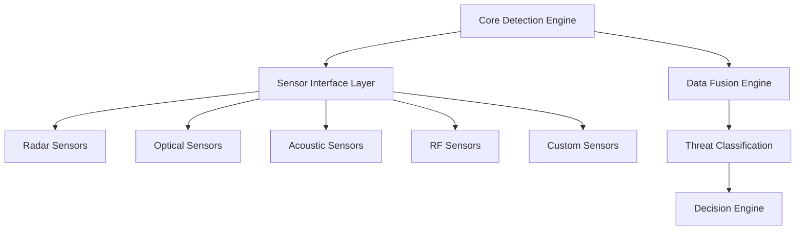

# Design Flexibility & Adaptation

## Overview

The Phoenix Rooivalk system architecture is designed with modularity and
adaptability as core principles, enabling the technology to evolve and adapt to
different operational environments, threat scenarios, and market requirements.
This document outlines the flexible design patterns and adaptation mechanisms
built into the system.

## Modular Architecture Principles

### 1. Sensor Integration Points

The system employs a plugin-based sensor architecture that allows for:

- **Multi-modal Detection**: Integration of radar, optical, acoustic, and RF
  sensors
- **Vendor Agnostic Design**: Standardized interfaces for different sensor
  manufacturers
- **Hot-swappable Components**: Runtime sensor replacement and configuration
- **Scalable Detection Networks**: Distributed sensor arrays with centralized
  coordination

### 2. Configurable Decision Algorithms

The autonomous decision-making system supports multiple algorithm
configurations:

- **Rule-based Systems**: Deterministic logic for well-defined scenarios
- **Machine Learning Models**: Adaptive algorithms for complex threat patterns
- **Hybrid Approaches**: Combination of rule-based and ML for robust
  decision-making
- **A/B Testing Framework**: Runtime algorithm switching for performance
  comparison

### 3. Adaptable Countermeasure Selection

The countermeasure system provides flexible response options:

- **Soft-kill First**: Non-destructive countermeasures (jamming, spoofing)
- **Escalation Protocols**: Progressive response based on threat assessment
- **Environmental Adaptation**: Countermeasures tailored to operational
  constraints
- **Legal Compliance**: Configurable response limits based on jurisdiction

## Multi-Domain Application Potential

### Civilian Applications

#### Airport Security

- **Perimeter Protection**: Automated detection and response for restricted
  airspace
- **Runway Monitoring**: Real-time threat assessment during aircraft operations
- **Passenger Safety**: Integration with airport security systems

#### Critical Infrastructure

- **Power Plants**: Protection of nuclear and conventional power facilities
- **Water Facilities**: Security for dams, treatment plants, and reservoirs
- **Communication Towers**: Protection of telecommunications infrastructure

#### Event Security

- **Stadiums**: Crowd protection during sporting events
- **Concerts**: Public safety for entertainment venues
- **Public Gatherings**: General event security applications

### Commercial Security

#### Corporate Campus Protection

- **Headquarters Security**: Protection of corporate facilities
- **R&D Facilities**: Intellectual property protection
- **Executive Protection**: VIP security services

#### Data Center Security

- **Server Farm Protection**: Critical infrastructure security
- **Cloud Infrastructure**: Distributed security systems
- **Network Operations Centers**: Communication facility protection

#### Port Security

- **Shipping Terminals**: Cargo and facility protection
- **Cargo Facilities**: Supply chain security
- **Maritime Operations**: Port authority security

### Research & Development Applications

#### University Partnerships

- **Academic Research**: Collaborative development programs
- **Student Projects**: Educational applications
- **Technology Transfer**: Research commercialization

#### Government Laboratories

- **DARPA Programs**: Defense research initiatives
- **NSF Projects**: National science foundation research
- **National Laboratories**: Government research facilities

#### International Cooperation

- **NATO Programs**: Allied defense research
- **Allied Defense Research**: International collaboration
- **Technology Sharing**: Multinational development

## Technology Adaptation Mechanisms

### 1. Software-Defined Architecture

- **Modular Components**: Independent system modules with standardized
  interfaces
- **Configuration Management**: Runtime system reconfiguration
- **Plugin Ecosystem**: Third-party component integration
- **API-First Design**: External system integration capabilities

### 2. Hardware Abstraction Layer

- **Vendor Independence**: Support for multiple hardware platforms
- **Performance Optimization**: Hardware-specific optimizations
- **Scalability**: Horizontal and vertical scaling capabilities
- **Cost Optimization**: Platform selection based on requirements

### 3. Regulatory Compliance Framework

- **Jurisdiction Awareness**: Automatic compliance with local regulations
- **Export Control**: Built-in ITAR and EAR compliance
- **Data Protection**: GDPR and privacy regulation compliance
- **Safety Standards**: Industry-specific safety requirements

## Market Adaptation Strategy

### Phase-Gate Decision Points

The system design includes strategic decision points for market adaptation:

1. **Technology Validation**: Core algorithm performance validation
2. **Market Assessment**: Target market analysis and validation
3. **Regulatory Review**: Compliance pathway determination
4. **Partnership Development**: Strategic partnership establishment
5. **Commercial Deployment**: Market entry and scaling

### Pivot Triggers and Criteria

Automated and manual triggers for strategic pivots:

- **Technical Performance**: System performance below thresholds
- **Market Response**: Insufficient market interest or adoption
- **Regulatory Changes**: New regulations affecting deployment
- **Competitive Landscape**: Significant competitive threats
- **Partnership Opportunities**: Strategic partnership possibilities

### Alternative Market Segments

Pre-defined market segments for rapid adaptation:

- **Defense & Military**: Primary defense applications
- **Critical Infrastructure**: Civilian infrastructure protection
- **Commercial Security**: Private sector security applications
- **Research & Development**: Academic and research applications
- **Technology Licensing**: IP licensing and technology transfer

## Implementation Guidelines

### 1. Modular Development

- Develop components as independent modules
- Implement standardized interfaces between modules
- Design for hot-swappable component replacement
- Plan for horizontal scaling from the beginning

### 2. Configuration Management

- Implement centralized configuration management
- Support runtime configuration changes
- Provide configuration validation and testing
- Document configuration options and dependencies

### 3. Testing and Validation

- Develop comprehensive testing frameworks
- Implement automated testing for all modules
- Plan for integration testing across components
- Establish performance benchmarking procedures

### 4. Documentation and Training

- Maintain comprehensive technical documentation
- Provide user training materials
- Document adaptation procedures
- Create troubleshooting guides

## Risk Mitigation

### Technical Risks

- **Component Failure**: Redundant systems and failover mechanisms
- **Performance Degradation**: Performance monitoring and optimization
- **Integration Issues**: Comprehensive testing and validation
- **Scalability Limits**: Horizontal scaling capabilities

### Market Risks

- **Regulatory Changes**: Flexible compliance framework
- **Competitive Threats**: Continuous innovation and differentiation
- **Market Shifts**: Multi-market capability
- **Partnership Dependencies**: Diversified partnership strategy

### Operational Risks

- **Deployment Complexity**: Simplified deployment procedures
- **Maintenance Requirements**: Automated maintenance capabilities
- **Training Needs**: Comprehensive training programs
- **Support Requirements**: Multi-tier support structure

## Conclusion

The Phoenix Rooivalk system's modular and adaptable architecture provides a
solid foundation for addressing multiple market segments and operational
requirements. The design flexibility enables rapid adaptation to changing market
conditions, regulatory requirements, and technological advances while
maintaining core system capabilities and performance standards.

The system's multi-domain application potential, combined with robust adaptation
mechanisms, positions Phoenix Rooivalk as a versatile technology platform
capable of serving diverse markets and use cases while maintaining its core
value proposition of autonomous, edge-based counter-drone defense.
