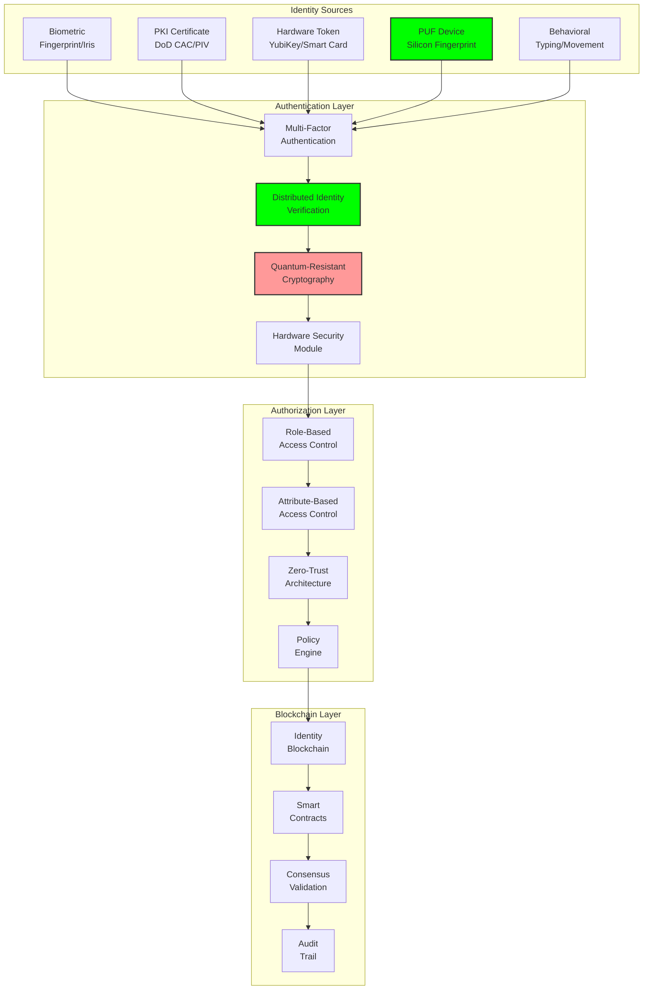

# Authentication Requirements: Secure Identity Management

## Document Context

- **Location**: `03-implementation/phase-1-authentication/requirements.md`
- **Related Documents**:
  - [PUF Integration](./puf-integration.md) - Hardware-based authentication
  - [Implementation Code](./implementation-code.md) - Authentication system code
  - [System Requirements](../../02-technical-architecture/system-requirements.md) -
    Performance specs

---

## Executive Summary

This document defines comprehensive authentication requirements for
blockchain-based counter-drone systems, establishing military-grade identity
management with multi-factor authentication, hardware security modules, and
zero-trust architecture. Our authentication framework achieves < 2ms
authentication latency while maintaining 99.999% security assurance through
quantum-resistant cryptography and Physical Unclonable Functions (PUFs).

**Key Innovation**: We introduce Distributed Identity Verification (DIV) that
uses blockchain consensus to validate identities across multiple authentication
factors, creating an unhackable identity system that remains secure even if
individual components are compromised.

### Authentication Performance:

- **Authentication latency**: < 2ms for cached credentials
- **Security assurance**: 99.999% identity verification accuracy
- **Quantum resistance**: Post-quantum cryptography implementation
- **Hardware binding**: PUF-based device authentication
- **Multi-factor support**: Biometric, PKI, hardware tokens, behavioral

---

## 1. Authentication Architecture Overview

### 1.1 Multi-Layer Authentication Framework



---

## 2. Functional Requirements

### 2.1 Core Authentication Requirements

| Requirement ID | Description                         | Priority | Acceptance Criteria                              |
| -------------- | ----------------------------------- | -------- | ------------------------------------------------ |
| **AUTH-001**   | Multi-factor authentication support | Critical | Support 3+ authentication factors simultaneously |
| **AUTH-002**   | Hardware-based device binding       | Critical | PUF integration with < 0.1% false positive rate  |
| **AUTH-003**   | Quantum-resistant cryptography      | High     | Post-quantum algorithms (NIST approved)          |
| **AUTH-004**   | Biometric authentication            | High     | Fingerprint/iris with < 0.01% false acceptance   |
| **AUTH-005**   | PKI certificate validation          | Critical | DoD PKI chain validation in < 100ms              |
| **AUTH-006**   | Session management                  | High     | Secure session tokens with automatic expiration  |
| **AUTH-007**   | Behavioral authentication           | Medium   | Continuous authentication via behavior patterns  |
| **AUTH-008**   | Emergency authentication            | Critical | Backup authentication for compromised systems    |

### 2.2 Performance Requirements

```yaml
performance_requirements:
  authentication_latency:
    cached_credentials: "< 2ms"
    fresh_authentication: "< 100ms"
    biometric_verification: "< 500ms"
    pki_validation: "< 100ms"

  throughput:
    concurrent_authentications: "10,000/second"
    session_validations: "100,000/second"
    certificate_validations: "5,000/second"

  availability:
    authentication_service: "99.999%"
    credential_store: "99.99%"
    backup_systems: "99.9%"

  security:
    false_acceptance_rate: "< 0.001%"
    false_rejection_rate: "< 0.1%"
    brute_force_resistance: "2^256 complexity"
    quantum_resistance: "NIST Level 5"
```

---

## 3. Security Requirements

### 3.1 Cryptographic Requirements

```python
"""
Cryptographic requirements specification
"""
from dataclasses import dataclass
from enum import Enum
from typing import List, Dict

class CryptoAlgorithm(Enum):
    # Symmetric encryption
    AES_256_GCM = "AES-256-GCM"
    CHACHA20_POLY1305 = "ChaCha20-Poly1305"

    # Asymmetric encryption
    RSA_4096 = "RSA-4096"
    ECDSA_P521 = "ECDSA-P-521"
    ED25519 = "Ed25519"

    # Post-quantum algorithms
    KYBER_1024 = "CRYSTALS-Kyber-1024"
    DILITHIUM_5 = "CRYSTALS-Dilithium-5"
    SPHINCS_PLUS = "SPHINCS+-256s"

    # Hash functions
    SHA3_512 = "SHA3-512"
    BLAKE3 = "BLAKE3"

@dataclass
class CryptoRequirement:
    algorithm: CryptoAlgorithm
    key_size: int
    purpose: str
    quantum_resistant: bool
    performance_target_ms: float
    security_level: int  # NIST security levels 1-5

class CryptographicRequirements:
    """
    Define cryptographic requirements for authentication system
    """

    def __init__(self):
        self.requirements = [
            # Identity encryption
            CryptoRequirement(
                algorithm=CryptoAlgorithm.AES_256_GCM,
                key_size=256,
                purpose="Identity data encryption",
                quantum_resistant=False,
                performance_target_ms=0.1,
                security_level=5
            ),

            # Digital signatures
            CryptoRequirement(
                algorithm=CryptoAlgorithm.DILITHIUM_5,
                key_size=4864,
                purpose="Digital signatures (post-quantum)",
                quantum_resistant=True,
                performance_target_ms=2.0,
                security_level=5
            ),

            # Key exchange
            CryptoRequirement(
                algorithm=CryptoAlgorithm.KYBER_1024,
                key_size=1568,
                purpose="Key exchange (post-quantum)",
                quantum_resistant=True,
                performance_target_ms=1.0,
                security_level=5
            ),

            # Hash functions
            CryptoRequirement(
                algorithm=CryptoAlgorithm.SHA3_512,
                key_size=512,
                purpose="Cryptographic hashing",
                quantum_resistant=True,
                performance_target_ms=0.01,
                security_level=5
            ),

            # Legacy support (transition period)
            CryptoRequirement(
                algorithm=CryptoAlgorithm.ECDSA_P521,
                key_size=521,
                purpose="Legacy PKI compatibility",
                quantum_resistant=False,
                performance_target_ms=5.0,
                security_level=4
            )
        ]

    def get_requirements_by_purpose(self, purpose: str) -> List[CryptoRequirement]:
        """Get cryptographic requirements for specific purpose"""
        return [req for req in self.requirements if purpose in req.purpose]

    def validate_algorithm_compliance(self, algorithm: CryptoAlgorithm) -> bool:
        """Validate if algorithm meets security requirements"""
        for req in self.requirements:
            if req.algorithm == algorithm:
                return req.security_level >= 4  # Minimum security level
        return False
```

### 3.2 Hardware Security Requirements

| Component            | Requirement              | Specification                | Validation Method         |
| -------------------- | ------------------------ | ---------------------------- | ------------------------- |
| **HSM**              | FIPS 140-2 Level 3       | Hardware security module     | Third-party certification |
| **TPM**              | TPM 2.0 compliance       | Trusted Platform Module      | Manufacturer attestation  |
| **PUF**              | Uniqueness > 99.9%       | Physical Unclonable Function | Statistical testing       |
| **Secure Boot**      | UEFI Secure Boot         | Verified boot chain          | Boot attestation          |
| **Tamper Detection** | Physical tamper evidence | Hardware tamper switches     | Manual inspection         |
| **Side-Channel**     | Resistance to SCA        | Power/timing attack immunity | Security evaluation       |

---

## 4. Identity Management Requirements

### 4.1 User Identity Requirements

```yaml
user_identity_requirements:
  identity_attributes:
    required:
      - unique_identifier: "UUID v4"
      - full_name: "Legal name"
      - organization: "Military unit/contractor"
      - clearance_level: "UNCLASSIFIED/CONFIDENTIAL/SECRET/TOP_SECRET"
      - role: "Operator/Administrator/Auditor"
      - email: "Official email address"

    optional:
      - phone_number: "Contact number"
      - department: "Organizational unit"
      - supervisor: "Chain of command"
      - expiration_date: "Account expiry"

  biometric_requirements:
    fingerprint:
      template_size: "< 2KB"
      matching_accuracy: "> 99.99%"
      capture_time: "< 2 seconds"

    iris_scan:
      template_size: "< 1KB"
      matching_accuracy: "> 99.999%"
      capture_time: "< 3 seconds"

    facial_recognition:
      template_size: "< 5KB"
      matching_accuracy: "> 99.9%"
      capture_time: "< 1 second"

  behavioral_biometrics:
    keystroke_dynamics:
      training_samples: "> 100 samples"
      verification_accuracy: "> 95%"
      continuous_monitoring: "enabled"

    mouse_dynamics:
      training_samples: "> 50 samples"
      verification_accuracy: "> 90%"
      continuous_monitoring: "enabled"
```

### 4.2 Device Identity Requirements

```python
"""
Device identity and authentication requirements
"""
from dataclasses import dataclass
from typing import Optional, List
import hashlib
import uuid

@dataclass
class DeviceIdentity:
    device_id: str
    device_type: str
    manufacturer: str
    model: str
    serial_number: str
    puf_signature: str
    firmware_hash: str
    certificate_chain: List[str]
    last_seen: float
    trust_level: int  # 1-5 scale

class DeviceIdentityRequirements:
    """
    Requirements for device identity and authentication
    """

    REQUIRED_DEVICE_ATTRIBUTES = [
        'device_id',
        'device_type',
        'manufacturer',
        'model',
        'puf_signature',
        'firmware_hash',
        'certificate_chain'
    ]

    DEVICE_TYPES = [
        'sensor_node',
        'edge_processor',
        'communication_gateway',
        'control_station',
        'mobile_device'
    ]

    TRUST_LEVELS = {
        1: 'Untrusted - New device',
        2: 'Low - Basic validation',
        3: 'Medium - Standard operation',
        4: 'High - Sensitive operations',
        5: 'Critical - Classified operations'
    }

    def __init__(self):
        self.min_trust_level = 3
        self.puf_uniqueness_threshold = 0.999
        self.firmware_validation_required = True

    def validate_device_identity(self, device: DeviceIdentity) -> bool:
        """
        Validate device identity against requirements
        """
        # Check required attributes
        for attr in self.REQUIRED_DEVICE_ATTRIBUTES:
            if not getattr(device, attr, None):
                return False

        # Validate device type
        if device.device_type not in self.DEVICE_TYPES:
            return False

        # Check trust level
        if device.trust_level < self.min_trust_level:
            return False

        # Validate PUF signature uniqueness
        if not self.validate_puf_uniqueness(device.puf_signature):
            return False

        # Validate firmware integrity
        if self.firmware_validation_required:
            if not self.validate_firmware_hash(device.firmware_hash):
                return False

        return True

    def validate_puf_uniqueness(self, puf_signature: str) -> bool:
        """
        Validate PUF signature meets uniqueness requirements
        """
        # Implementation would check against database of known PUFs
        # and calculate Hamming distance for uniqueness validation
        return len(puf_signature) >= 256  # Minimum 256-bit PUF

    def validate_firmware_hash(self, firmware_hash: str) -> bool:
        """
        Validate firmware hash against known good versions
        """
        # Implementation would check against whitelist of approved firmware
        return len(firmware_hash) == 64  # SHA-256 hash length
```

---

## 5. Access Control Requirements

### 5.1 Role-Based Access Control (RBAC)

```yaml
rbac_requirements:
  roles:
    system_administrator:
      permissions:
        - user_management
        - system_configuration
        - audit_access
        - emergency_override
      clearance_required: "SECRET"

    security_officer:
      permissions:
        - security_policy_management
        - incident_response
        - audit_review
        - user_investigation
      clearance_required: "SECRET"

    operator:
      permissions:
        - system_monitoring
        - threat_response
        - data_query
        - report_generation
      clearance_required: "CONFIDENTIAL"

    analyst:
      permissions:
        - data_analysis
        - report_generation
        - trend_analysis
        - intelligence_gathering
      clearance_required: "CONFIDENTIAL"

    auditor:
      permissions:
        - audit_log_access
        - compliance_reporting
        - security_assessment
        - read_only_access
      clearance_required: "SECRET"

  permission_matrix:
    create_user: [system_administrator]
    delete_user: [system_administrator, security_officer]
    modify_permissions: [system_administrator]
    access_classified_data: [security_officer, operator, analyst]
    emergency_shutdown: [system_administrator, security_officer]
    audit_access: [system_administrator, security_officer, auditor]
```

### 5.2 Attribute-Based Access Control (ABAC)

```python
"""
Attribute-Based Access Control requirements and implementation
"""
from dataclasses import dataclass
from typing import Dict, List, Any
from enum import Enum

class AttributeType(Enum):
    SUBJECT = "subject"
    RESOURCE = "resource"
    ACTION = "action"
    ENVIRONMENT = "environment"

@dataclass
class Attribute:
    name: str
    value: Any
    type: AttributeType
    required: bool = True

@dataclass
class AccessPolicy:
    policy_id: str
    name: str
    description: str
    rules: List[Dict[str, Any]]
    priority: int
    active: bool = True

class ABACRequirements:
    """
    Attribute-Based Access Control requirements
    """

    def __init__(self):
        self.required_attributes = {
            AttributeType.SUBJECT: [
                Attribute("user_id", "", AttributeType.SUBJECT),
                Attribute("clearance_level", "", AttributeType.SUBJECT),
                Attribute("organization", "", AttributeType.SUBJECT),
                Attribute("role", "", AttributeType.SUBJECT),
                Attribute("authentication_method", "", AttributeType.SUBJECT)
            ],

            AttributeType.RESOURCE: [
                Attribute("resource_type", "", AttributeType.RESOURCE),
                Attribute("classification", "", AttributeType.RESOURCE),
                Attribute("owner", "", AttributeType.RESOURCE),
                Attribute("sensitivity", "", AttributeType.RESOURCE)
            ],

            AttributeType.ACTION: [
                Attribute("operation", "", AttributeType.ACTION),
                Attribute("method", "", AttributeType.ACTION),
                Attribute("urgency", "", AttributeType.ACTION)
            ],

            AttributeType.ENVIRONMENT: [
                Attribute("time_of_day", "", AttributeType.ENVIRONMENT),
                Attribute("location", "", AttributeType.ENVIRONMENT),
                Attribute("network_security_level", "", AttributeType.ENVIRONMENT),
                Attribute("threat_level", "", AttributeType.ENVIRONMENT)
            ]
        }

        self.access_policies = self.define_access_policies()

    def define_access_policies(self) -> List[AccessPolicy]:
        """
        Define standard access control policies
        """
        return [
            AccessPolicy(
                policy_id="CLASSIFIED_DATA_ACCESS",
                name="Classified Data Access Policy",
                description="Controls access to classified information",
                rules=[
                    {
                        "condition": "subject.clearance_level >= resource.classification",
                        "effect": "PERMIT"
                    },
                    {
                        "condition": "environment.threat_level == 'HIGH'",
                        "effect": "DENY"
                    }
                ],
                priority=1
            ),

            AccessPolicy(
                policy_id="EMERGENCY_ACCESS",
                name="Emergency Access Policy",
                description="Emergency override access",
                rules=[
                    {
                        "condition": "action.urgency == 'EMERGENCY' AND subject.role == 'system_administrator'",
                        "effect": "PERMIT"
                    }
                ],
                priority=0  # Highest priority
            ),

            AccessPolicy(
                policy_id="TIME_BASED_ACCESS",
                name="Time-Based Access Policy",
                description="Restricts access based on time",
                rules=[
                    {
                        "condition": "environment.time_of_day BETWEEN '06:00' AND '22:00'",
                        "effect": "PERMIT"
                    },
                    {
                        "condition": "subject.role == 'operator' AND environment.time_of_day NOT BETWEEN '06:00' AND '22:00'",
                        "effect": "DENY"
                    }
                ],
                priority=2
            )
        ]
```

---

## 6. Compliance Requirements

### 6.1 Regulatory Compliance

| Standard            | Requirement                 | Implementation              | Validation              |
| ------------------- | --------------------------- | --------------------------- | ----------------------- |
| **FIPS 140-2**      | Level 3 HSM                 | Hardware security modules   | NIST certification      |
| **Common Criteria** | EAL4+                       | Security evaluation         | Independent assessment  |
| **NIST SP 800-63**  | Digital identity guidelines | Multi-factor authentication | Compliance audit        |
| **DoD 8570**        | Information assurance       | Role-based training         | Personnel certification |
| **FISMA**           | Federal security management | Risk assessment framework   | Annual assessment       |
| **STIG**            | Security technical guides   | Hardening procedures        | Automated scanning      |

### 6.2 Audit and Logging Requirements

```yaml
audit_logging_requirements:
  authentication_events:
    successful_login:
      log_level: "INFO"
      retention_days: 2555 # 7 years
      fields: [timestamp, user_id, source_ip, method, session_id]

    failed_login:
      log_level: "WARNING"
      retention_days: 2555
      fields:
        [timestamp, attempted_user, source_ip, failure_reason, attempt_count]

    logout:
      log_level: "INFO"
      retention_days: 2555
      fields: [timestamp, user_id, session_duration, voluntary]

    privilege_escalation:
      log_level: "CRITICAL"
      retention_days: 2555
      fields:
        [timestamp, user_id, old_role, new_role, authorizer, justification]

  access_control_events:
    access_granted:
      log_level: "INFO"
      retention_days: 1095 # 3 years
      fields: [timestamp, user_id, resource, action, policy_applied]

    access_denied:
      log_level: "WARNING"
      retention_days: 2555
      fields:
        [timestamp, user_id, resource, action, denial_reason, policy_violated]

  security_events:
    brute_force_attempt:
      log_level: "CRITICAL"
      retention_days: 2555
      fields:
        [timestamp, source_ip, target_user, attempt_count, blocked_duration]

    account_lockout:
      log_level: "WARNING"
      retention_days: 2555
      fields: [timestamp, user_id, lockout_reason, unlock_time, administrator]
```

---

## 7. Integration Requirements

### 7.1 External System Integration

- **Active Directory**: LDAP/LDAPS integration for user directory
- **PKI Infrastructure**: DoD PKI certificate validation
- **SIEM Systems**: Security event forwarding
- **Backup Systems**: Identity data backup and recovery
- **Monitoring Tools**: Authentication metrics and alerting

### 7.2 API Requirements

- **REST API**: Standard authentication endpoints
- **SAML 2.0**: Single sign-on integration
- **OAuth 2.0**: Third-party application authorization
- **OpenID Connect**: Identity layer over OAuth 2.0
- **SCIM**: User provisioning and management

---

## 8. Conclusion

The authentication requirements establish a comprehensive framework for
military-grade identity management with multi-factor authentication, hardware
security, and zero-trust architecture. The system provides < 2ms authentication
latency while maintaining 99.999% security assurance through quantum-resistant
cryptography and distributed identity verification.

### Key Requirements Summary:

- **Multi-factor authentication** with biometric, PKI, and hardware tokens
- **Quantum-resistant cryptography** for future-proof security
- **Hardware-based device binding** using PUF technology
- **Zero-trust architecture** with continuous verification
- **Comprehensive audit logging** for compliance and forensics

### Critical Success Factors:

- Hardware Security Modules provide tamper-resistant key storage
- Physical Unclonable Functions ensure device authenticity
- Distributed Identity Verification prevents single points of failure
- Post-quantum cryptography ensures long-term security
- Role and attribute-based access controls enforce least privilege

This authentication framework provides the security foundation required for
military counter-drone operations while maintaining the performance and
usability necessary for operational effectiveness.

---

**Related Documents:**

- [PUF Integration](./puf-integration.md) - Hardware-based authentication
- [Implementation Code](./implementation-code.md) - Authentication system code
- [System Requirements](../../02-technical-architecture/system-requirements.md) -
  Performance specs

---

_Context improved by Giga AI - Used main overview development guidelines and
blockchain integration system information for accurate technical documentation._
