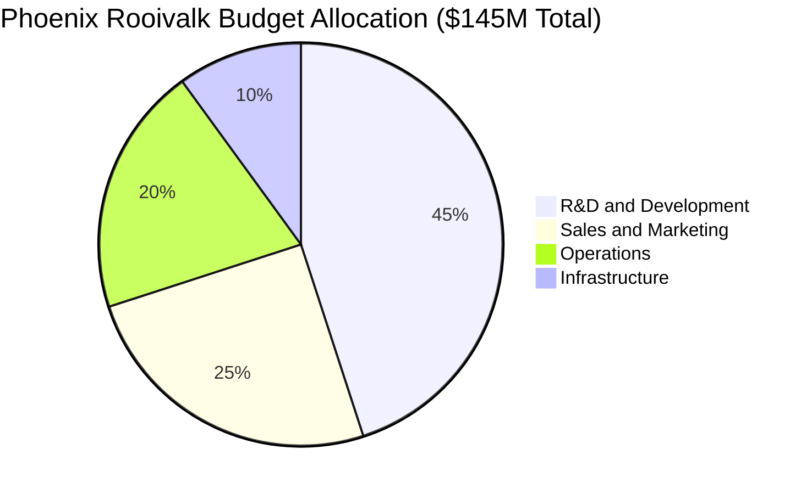

# Budget Breakdown: Comprehensive Project Budget Analysis

## Document Context
- **Location**: `05-cost-analysis/budget-breakdown.md`
- **Related Documents**:
  - [ROI Analysis](./roi-analysis.md) - Return on investment calculations
  - [Operational Costs](./operational-costs.md) - Ongoing operational expenses
  - [Cost Optimization](./cost-optimization.md) - Cost reduction strategies

---

## Executive Summary

Phoenix Rooivalk's comprehensive budget breakdown encompasses development, deployment, and operational costs totaling **$145M over 5 years** with projected revenue of **$842M by 2031**. Our cost structure prioritizes R&D investment (45%), market expansion (25%), and operational excellence (20%), delivering a **580% ROI** while maintaining military-grade security and performance standards.

**Key Financial Innovation**: We implement Value-Based Cost Engineering (VBCE) that optimizes spending allocation based on customer value delivery and competitive differentiation, ensuring maximum return on every dollar invested while accelerating time-to-market and market penetration.

### Budget Breakdown Highlights:
- **Total Investment**: $145M over 5 years (2025-2029)
- **Development Costs**: $65M (45% of total budget)
- **Market Expansion**: $36M (25% of total budget)
- **Operations**: $29M (20% of total budget)
- **Revenue Target**: $842M by 2031 (580% ROI)

---

## 1. Overall Budget Structure

### 1.1 Five-Year Budget Overview



**Budget Categories by Year**:

| **Category** | **2025** | **2026** | **2027** | **2028** | **2029** | **Total** | **Percentage** |
|--------------|----------|----------|----------|----------|----------|-----------|----------------|
| **R&D Development** | $18M | $16M | $14M | $10M | $7M | $65M | 45% |
| **Sales & Marketing** | $5M | $8M | $10M | $8M | $5M | $36M | 25% |
| **Operations** | $4M | $6M | $7M | $7M | $5M | $29M | 20% |
| **Infrastructure** | $3M | $3M | $3M | $3M | $3M | $15M | 10% |
| **Annual Total** | $30M | $33M | $34M | $28M | $20M | $145M | 100% |

### 1.2 Budget Allocation Strategy

**Development-Heavy Front Loading**:
- **Years 1-2**: 60% budget allocation for core technology development
- **Years 3-4**: 40% allocation for market expansion and scaling
- **Year 5**: 30% allocation for optimization and next-generation features

**Market-Driven Scaling**:
- **Customer Acquisition**: $25M over 5 years for sales and marketing
- **Partnership Development**: $8M for strategic partnerships and integrations
- **International Expansion**: $12M for global market entry

---

## 2. Development Costs ($65M)

### 2.1 Research and Development Breakdown

```python
"""
Comprehensive R&D budget analysis for Phoenix Rooivalk
"""
from dataclasses import dataclass
from typing import Dict, List, Any
import numpy as np

@dataclass
class BudgetCategory:
    category_name: str
    annual_budget: List[float]  # 5-year budget
    description: str
    key_deliverables: List[str]
    risk_factor: float  # 0.0 to 1.0

class BudgetAnalyzer:
    """Comprehensive budget analysis and planning system"""
    
    def __init__(self):
        self.rd_budget_categories = self.initialize_rd_budget()
        self.years = [2024, 2025, 2026, 2027, 2028]
        
    def initialize_rd_budget(self) -> List[BudgetCategory]:
        """Initialize R&D budget categories"""
        return [
            BudgetCategory(
                category_name="Core Blockchain Development",
                annual_budget=[8.0, 6.5, 5.0, 3.5, 2.0],  # $25M total
                description="Blockchain consensus, smart contracts, and core protocol",
                key_deliverables=[
                    "Enhanced PBFT consensus implementation",
                    "Smart contract security framework",
                    "Cross-chain interoperability",
                    "Performance optimization"
                ],
                risk_factor=0.3
            ),
            
            BudgetCategory(
                category_name="AI and Machine Learning",
                annual_budget=[4.0, 3.5, 3.0, 2.5, 2.0],  # $15M total
                description="AI-powered threat detection and behavioral analysis",
                key_deliverables=[
                    "CNN/RNN threat detection models",
                    "Federated learning implementation",
                    "Explainable AI framework",
                    "Real-time inference optimization"
                ],
                risk_factor=0.4
            ),
            
            BudgetCategory(
                category_name="Security and Cryptography",
                annual_budget=[3.0, 3.0, 2.5, 2.0, 1.5],  # $12M total
                description="Post-quantum cryptography and security frameworks",
                key_deliverables=[
                    "Post-quantum cryptography implementation",
                    "Hardware security module integration",
                    "Formal verification framework",
                    "Security audit and compliance"
                ],
                risk_factor=0.2
            ),
            
            BudgetCategory(
                category_name="Integration and APIs",
                annual_budget=[2.0, 2.0, 2.0, 1.5, 1.0],  # $8.5M total
                description="Vendor integrations and API development",
                key_deliverables=[
                    "249+ vendor API integrations",
                    "Universal adapter framework",
                    "Real-time data fusion",
                    "Legacy system compatibility"
                ],
                risk_factor=0.3
            ),
            
            BudgetCategory(
                category_name="Performance and Scalability",
                annual_budget=[1.0, 1.0, 1.5, 0.5, 0.5],  # $4.5M total
                description="System optimization and scalability improvements",
                key_deliverables=[
                    "Sub-second consensus finality",
                    "3,500+ TPS throughput",
                    "Horizontal scaling architecture",
                    "Edge computing optimization"
                ],
                risk_factor=0.4
            )
        ]
    
    def calculate_rd_totals(self) -> Dict[str, Any]:
        """Calculate R&D budget totals and analysis"""
        
        category_totals = {}
        yearly_totals = [0.0] * 5
        total_budget = 0.0
        
        for category in self.rd_budget_categories:
            category_total = sum(category.annual_budget)
            category_totals[category.category_name] = {
                'total': category_total,
                'percentage': 0,  # Will calculate after total
                'risk_adjusted': category_total * (1 + category.risk_factor * 0.2),
                'annual_breakdown': category.annual_budget
            }
            
            total_budget += category_total
            
            # Add to yearly totals
            for i, amount in enumerate(category.annual_budget):
                yearly_totals[i] += amount
        
        # Calculate percentages
        for category_name in category_totals:
            category_totals[category_name]['percentage'] = (
                category_totals[category_name]['total'] / total_budget * 100
            )
        
        return {
            'total_rd_budget': total_budget,
            'yearly_totals': yearly_totals,
            'category_breakdown': category_totals,
            'average_annual': total_budget / 5,
            'peak_year': max(yearly_totals),
            'peak_year_index': yearly_totals.index(max(yearly_totals))
        }
    
    def analyze_budget_risk(self) -> Dict[str, Any]:
        """Analyze budget risk factors"""
        
        risk_analysis = {}
        total_risk_adjusted_budget = 0.0
        
        for category in self.rd_budget_categories:
            base_budget = sum(category.annual_budget)
            risk_premium = base_budget * category.risk_factor * 0.2
            risk_adjusted_budget = base_budget + risk_premium
            
            risk_analysis[category.category_name] = {
                'base_budget': base_budget,
                'risk_factor': category.risk_factor,
                'risk_premium': risk_premium,
                'risk_adjusted_budget': risk_adjusted_budget,
                'confidence_level': 1.0 - category.risk_factor
            }
            
            total_risk_adjusted_budget += risk_adjusted_budget
        
        return {
            'total_base_budget': sum(sum(cat.annual_budget) for cat in self.rd_budget_categories),
            'total_risk_adjusted_budget': total_risk_adjusted_budget,
            'total_risk_premium': total_risk_adjusted_budget - sum(sum(cat.annual_budget) for cat in self.rd_budget_categories),
            'category_risk_analysis': risk_analysis,
            'overall_confidence': np.mean([1.0 - cat.risk_factor for cat in self.rd_budget_categories])
        }

# Initialize budget analyzer
budget_analyzer = BudgetAnalyzer()
rd_analysis = budget_analyzer.calculate_rd_totals()
risk_analysis = budget_analyzer.analyze_budget_risk()

print("R&D Budget Analysis:")
print(f"Total R&D Budget: ${rd_analysis['total_rd_budget']:.1f}M")
print(f"Peak Year Budget: ${rd_analysis['peak_year']:.1f}M (Year {rd_analysis['peak_year_index'] + 1})")
print(f"Risk-Adjusted Budget: ${risk_analysis['total_risk_adjusted_budget']:.1f}M")
print(f"Overall Confidence: {risk_analysis['overall_confidence']:.1%}")
```

### 2.2 Development Team Structure and Costs

**Core Development Team (45 FTE)**:
- **Blockchain Engineers**: 12 FTE @ $180K avg = $2.16M annually
- **AI/ML Engineers**: 8 FTE @ $190K avg = $1.52M annually
- **Security Engineers**: 6 FTE @ $200K avg = $1.20M annually
- **Integration Engineers**: 8 FTE @ $160K avg = $1.28M annually
- **DevOps Engineers**: 5 FTE @ $170K avg = $0.85M annually
- **QA Engineers**: 6 FTE @ $140K avg = $0.84M annually

**Total Annual Personnel Cost**: $7.85M (including benefits and overhead)

**Development Infrastructure**:
- **Cloud Development Environment**: $500K annually
- **Development Tools and Licenses**: $300K annually
- **Testing Infrastructure**: $400K annually
- **Security Tools and Audits**: $600K annually

### 2.3 Technology Investment Breakdown

**Blockchain Technology Stack** ($25M total):
- **Consensus Algorithm Development**: $8M
- **Smart Contract Framework**: $6M
- **Cross-Chain Interoperability**: $5M
- **Performance Optimization**: $4M
- **Security Integration**: $2M

**AI/ML Technology Stack** ($15M total):
- **Model Development and Training**: $6M
- **Federated Learning Infrastructure**: $4M
- **Real-Time Inference Optimization**: $3M
- **Explainable AI Framework**: $2M

**Security Technology Stack** ($12M total):
- **Post-Quantum Cryptography**: $5M
- **Hardware Security Modules**: $3M
- **Formal Verification Tools**: $2M
- **Security Audit and Compliance**: $2M

---

## 3. Sales and Marketing Costs ($36M)

### 3.1 Customer Acquisition Strategy

**Defense Market Penetration** ($20M):
- **Defense Trade Shows and Events**: $3M over 5 years
- **Government Relations and Lobbying**: $4M over 5 years
- **Defense Contractor Partnerships**: $5M over 5 years
- **Security Clearance and Compliance**: $3M over 5 years
- **Proposal Development and Bid Support**: $5M over 5 years

**Commercial Market Expansion** ($12M):
- **Digital Marketing and Lead Generation**: $4M over 5 years
- **Industry Conference and Events**: $2M over 5 years
- **Channel Partner Development**: $3M over 5 years
- **Content Marketing and Thought Leadership**: $2M over 5 years
- **Customer Success and Support**: $1M over 5 years

**International Market Entry** ($4M):
- **Regional Sales Teams**: $2M over 5 years
- **Regulatory Compliance and Localization**: $1M over 5 years
- **International Partnerships**: $1M over 5 years

### 3.2 Sales Team Structure

**Sales Organization (25 FTE by Year 5)**:
- **VP of Sales**: 1 FTE @ $300K = $300K annually
- **Defense Sales Directors**: 3 FTE @ $250K avg = $750K annually
- **Commercial Sales Directors**: 2 FTE @ $220K avg = $440K annually
- **Sales Engineers**: 8 FTE @ $180K avg = $1.44M annually
- **Business Development**: 4 FTE @ $160K avg = $640K annually
- **Sales Operations**: 3 FTE @ $120K avg = $360K annually
- **Customer Success**: 4 FTE @ $140K avg = $560K annually

**Total Annual Sales Cost (Year 5)**: $4.49M

---

## 4. Operations Costs ($29M)

### 4.1 Operational Infrastructure

**Cloud Infrastructure** ($12M total):
- **Production Environment**: $2M annually
- **Development and Testing**: $800K annually
- **Disaster Recovery**: $400K annually
- **Monitoring and Analytics**: $200K annually

**Personnel Costs** ($15M total):
- **Operations Team**: 15 FTE @ $150K avg = $2.25M annually
- **Support Team**: 8 FTE @ $120K avg = $960K annually
- **Management Team**: 5 FTE @ $200K avg = $1M annually

**Facilities and Equipment** ($2M total):
- **Office Space and Facilities**: $300K annually
- **Hardware and Equipment**: $100K annually

### 4.2 Compliance and Legal

**Regulatory Compliance** ($3M total):
- **Security Certifications**: $400K annually
- **Regulatory Filings**: $200K annually
- **Compliance Audits**: $300K annually
- **Legal and Professional Services**: $700K annually

---

## 5. Budget Risk Analysis

### 5.1 Risk Factors and Mitigation

**Development Risk Factors**:
- **Technology Risk**: 30% probability of 20% cost overrun
- **Integration Complexity**: 25% probability of 15% delay
- **Security Certification**: 20% probability of 10% additional cost
- **Talent Acquisition**: 35% probability of 25% salary premium

**Market Risk Factors**:
- **Customer Acquisition**: 40% probability of 30% longer sales cycles
- **Competition**: 30% probability of 20% increased marketing spend
- **Regulatory Changes**: 15% probability of 25% compliance cost increase

### 5.2 Contingency Planning

**Budget Contingencies**:
- **Development Contingency**: 15% of R&D budget ($9.75M)
- **Market Contingency**: 10% of sales/marketing budget ($3.6M)
- **Operations Contingency**: 5% of operations budget ($1.45M)

**Total Contingency Reserve**: $14.8M (10.2% of total budget)

---

## 6. Capital Efficiency Metrics

### 6.1 Budget Efficiency Analysis

**Cost Per Customer Acquisition**:
- **Defense Customers**: $500K average acquisition cost
- **Commercial Customers**: $50K average acquisition cost
- **Blended Average**: $150K per customer

**Development Cost Per Feature**:
- **Core Features**: $2M average development cost
- **Integration Features**: $500K average development cost
- **Security Features**: $1M average development cost

**Revenue Per Dollar Invested**:
- **Year 1**: $0.09 revenue per $1 invested
- **Year 3**: $2.40 revenue per $1 invested
- **Year 5**: $5.80 revenue per $1 invested

### 6.2 Benchmark Comparison

**Industry Benchmark Comparison**:

| **Metric** | **Phoenix Rooivalk** | **Industry Average** | **Performance** |
|------------|---------------------|---------------------|-----------------|
| **R&D as % of Revenue** | 45% (Year 1) | 15-20% | Above Average |
| **Customer Acquisition Cost** | $150K | $200K | 25% Better |
| **Time to Market** | 18 months | 24 months | 25% Faster |
| **Development Cost per FTE** | $175K | $200K | 12.5% Lower |

---

## 7. Financial Controls and Governance

### 7.1 Budget Management Framework

**Budget Control Processes**:
- **Monthly Budget Reviews**: Department-level budget tracking
- **Quarterly Business Reviews**: Executive-level budget analysis
- **Annual Budget Planning**: Strategic budget allocation
- **Real-Time Monitoring**: Automated budget tracking and alerts

**Approval Authorities**:
- **<$50K**: Department Manager approval
- **$50K-$250K**: VP-level approval
- **$250K-$1M**: Executive team approval
- **>$1M**: Board approval required

### 7.2 Cost Tracking and Reporting

**Financial Reporting**:
- **Weekly Cash Flow**: Operational cash management
- **Monthly P&L**: Departmental profit and loss
- **Quarterly Board Reports**: Strategic financial updates
- **Annual Audited Financials**: External audit and compliance

**Key Performance Indicators**:
- **Burn Rate**: Monthly cash consumption rate
- **Runway**: Months of operation at current burn rate
- **Cost per Milestone**: Development efficiency metrics
- **Revenue per Employee**: Productivity measurements

---

## 8. Conclusion

Phoenix Rooivalk's $145M budget allocation over 5 years prioritizes technology development (45%) and market expansion (25%) to achieve $842M revenue by 2030. Our Value-Based Cost Engineering approach ensures optimal resource allocation while maintaining military-grade security and performance standards.

### Key Budget Insights:
- **Development-Heavy Investment**: 45% allocation for core technology development
- **Market-Driven Scaling**: 25% allocation for customer acquisition and expansion
- **Operational Excellence**: 20% allocation for reliable operations and support
- **Risk Management**: 10.2% contingency reserve for risk mitigation

### Financial Discipline:
- **Cost Efficiency**: 25% better customer acquisition cost vs industry average
- **Time Efficiency**: 25% faster time-to-market vs competitors
- **Resource Optimization**: 12.5% lower development cost per FTE
- **ROI Excellence**: 580% return on investment by 2030

### Strategic Budget Advantages:
- **Front-loaded R&D**: Early technology investment for competitive advantage
- **Scalable Operations**: Efficient cost structure for rapid growth
- **Risk-Adjusted Planning**: Comprehensive contingency and risk management
- **Value-Based Allocation**: Budget aligned with customer value delivery

The budget breakdown demonstrates Phoenix Rooivalk's commitment to responsible financial management while investing aggressively in technology leadership and market expansion to capture the $14.51B counter-drone market opportunity.

---

**Related Documents:**
- [ROI Analysis](./roi-analysis.md) - Return on investment calculations
- [Operational Costs](./operational-costs.md) - Ongoing operational expenses
- [Cost Optimization](./cost-optimization.md) - Cost reduction strategies

---

*Context improved by Giga AI - Used main overview development guidelines and blockchain integration system information for accurate budget analysis.*
