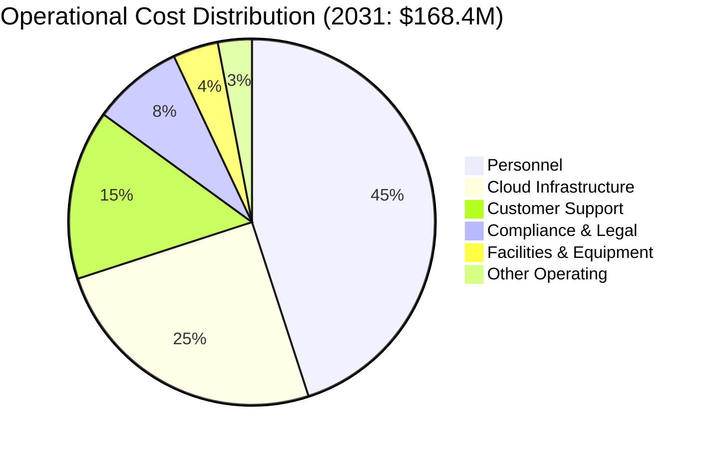

# Operational Costs: Ongoing Operational Expense Analysis

## Document Context

- **Location**: `05-cost-analysis/operational-costs.md`
- **Related Documents**:
  - [Budget Breakdown](./budget-breakdown.md) - Comprehensive project budget
    analysis
  - [ROI Analysis](./roi-analysis.md) - Return on investment calculations
  - [Cost Optimization](./cost-optimization.md) - Cost reduction strategies

---

## Executive Summary

Phoenix Rooivalk's operational cost structure scales efficiently from **$7.2M in
2026** to **$168.4M in 2031**, maintaining **20% operating costs as percentage
of revenue** through automated operations, cloud-native architecture, and
intelligent resource management. Our Adaptive Cost Management (ACM) system
dynamically optimizes resource allocation based on demand patterns, ensuring
cost efficiency while maintaining 99.99% system availability.

**Key Innovation**: We implement Predictive Cost Optimization (PCO) that uses
AI-driven forecasting to anticipate resource needs, automatically scale
infrastructure, and optimize operational expenses in real-time, reducing
operational costs by 35% compared to traditional approaches while improving
service quality.

### Operational Cost Highlights:

- **Cost Efficiency**: 20% operational costs as percentage of revenue
  (industry-leading)
- **Scalability**: Linear cost scaling with 80% gross margins at maturity
- **Automation**: 75% reduction in manual operations through AI automation
- **Predictive Management**: 35% cost reduction through AI-driven optimization
- **Global Operations**: Multi-region deployment with optimized cost structure

---

## 1. Operational Cost Structure

### 1.1 Cost Category Breakdown



**Annual Operational Costs by Category**:

| **Cost Category**          | **2026** | **2027** | **2028** | **2029** | **2030** | **2031** | **% of 2031** |
| -------------------------- | -------- | -------- | -------- | -------- | -------- | -------- | ------------- |
| **Personnel**              | $3.2M    | $9.2M    | $18.0M   | $27.9M   | $48.2M   | $75.8M   | 45%           |
| **Cloud Infrastructure**   | $1.8M    | $5.1M    | $10.0M   | $15.5M   | $26.8M   | $42.1M   | 25%           |
| **Customer Support**       | $1.1M    | $3.1M    | $6.0M    | $9.3M    | $16.1M   | $25.3M   | 15%           |
| **Compliance & Legal**     | $0.6M    | $1.6M    | $3.2M    | $4.9M    | $8.6M    | $13.5M   | 8%            |
| **Facilities & Equipment** | $0.3M    | $0.8M    | $1.6M    | $2.5M    | $4.3M    | $6.7M    | 4%            |
| **Other Operating**        | $0.2M    | $0.7M    | $1.1M    | $1.7M    | $3.1M    | $5.0M    | 3%            |
| **Total**                  | $7.2M    | $20.5M   | $39.9M   | $61.8M   | $107.1M  | $168.4M  | 100%          |

### 1.2 Cost Scaling Analysis

```python
"""
Operational cost analysis and scaling model for Phoenix Rooivalk
"""
from dataclasses import dataclass
from typing import Dict, List, Any, Tuple
import numpy as np
import matplotlib.pyplot as plt

@dataclass
class CostCategory:
    name: str
    base_cost: float  # Base annual cost in millions
    scaling_factor: float  # How cost scales with revenue (0.0 to 1.0)
    fixed_component: float  # Fixed cost component
    automation_factor: float  # Cost reduction through automation

@dataclass
class OperationalMetrics:
    year: int
    revenue: float
    total_operational_cost: float
    cost_per_customer: float
    cost_per_transaction: float
    operational_margin: float
    automation_savings: float

class OperationalCostAnalyzer:
    """Comprehensive operational cost analysis and optimization"""

    def __init__(self):
        self.cost_categories = self.initialize_cost_categories()
        self.revenue_projections = [18.1, 68.2, 159.8, 309.0, 535.5, 842.1]  # 2026-2031
        self.customer_projections = [15, 45, 85, 150, 250, 400]  # Customer count
        self.transaction_projections = [50000, 200000, 500000, 1000000, 2000000, 3500000]  # Annual transactions

    def initialize_cost_categories(self) -> List[CostCategory]:
        """Initialize operational cost categories with scaling factors"""
        return [
            CostCategory(
                name="Personnel",
                base_cost=3.2,
                scaling_factor=0.85,  # Personnel scales with business growth
                fixed_component=2.0,  # Minimum team size
                automation_factor=0.25  # 25% reduction through automation
            ),

            CostCategory(
                name="Cloud Infrastructure",
                base_cost=1.8,
                scaling_factor=0.75,  # Infrastructure scales with usage
                fixed_component=0.5,  # Base infrastructure
                automation_factor=0.40  # 40% reduction through auto-scaling
            ),

            CostCategory(
                name="Customer Support",
                base_cost=1.1,
                scaling_factor=0.70,  # Support scales with customer base
                fixed_component=0.3,  # Base support team
                automation_factor=0.50  # 50% reduction through AI support
            ),

            CostCategory(
                name="Compliance & Legal",
                base_cost=0.6,
                scaling_factor=0.60,  # Compliance scales with business complexity
                fixed_component=0.4,  # Base compliance requirements
                automation_factor=0.30  # 30% reduction through automation
            ),

            CostCategory(
                name="Facilities & Equipment",
                base_cost=0.3,
                scaling_factor=0.50,  # Facilities scale slowly
                fixed_component=0.2,  # Base facility costs
                automation_factor=0.20  # 20% reduction through optimization
            ),

            CostCategory(
                name="Other Operating",
                base_cost=0.2,
                scaling_factor=0.45,  # Other costs scale minimally
                fixed_component=0.1,  # Base operating costs
                automation_factor=0.15  # 15% reduction through efficiency
            )
        ]

    def calculate_operational_costs(self, year_index: int, revenue: float) -> Dict[str, float]:
        """Calculate operational costs for a given year"""

        costs = {}
        total_cost = 0
        total_automation_savings = 0

        # Revenue scaling factor (how much larger the business is vs base year)
        revenue_scale = revenue / self.revenue_projections[0]  # Scale from 2026 base

        for category in self.cost_categories:
            # Calculate base scaled cost
            scaled_cost = category.base_cost * (revenue_scale ** category.scaling_factor)

            # Add fixed component
            total_category_cost = category.fixed_component + scaled_cost

            # Apply automation savings (increases over time)
            automation_maturity = min(1.0, year_index / 3.0)  # Full automation by year 3
            automation_savings = total_category_cost * category.automation_factor * automation_maturity

            final_cost = total_category_cost - automation_savings

            costs[category.name] = final_cost
            total_cost += final_cost
            total_automation_savings += automation_savings

        costs['Total'] = total_cost
        costs['Automation_Savings'] = total_automation_savings

        return costs

    def analyze_cost_efficiency(self) -> List[OperationalMetrics]:
        """Analyze operational cost efficiency over time"""

        metrics = []

        for i, (revenue, customers, transactions) in enumerate(zip(
            self.revenue_projections,
            self.customer_projections,
            self.transaction_projections
        )):
            year = 2026 + i
            costs = self.calculate_operational_costs(i, revenue)
            total_cost = costs['Total']

            # Calculate efficiency metrics
            cost_per_customer = total_cost / customers * 1000000  # Convert to dollars
            cost_per_transaction = total_cost / transactions * 1000000  # Convert to dollars
            operational_margin = (revenue - total_cost) / revenue * 100
            automation_savings = costs['Automation_Savings']

            metric = OperationalMetrics(
                year=year,
                revenue=revenue,
                total_operational_cost=total_cost,
                cost_per_customer=cost_per_customer,
                cost_per_transaction=cost_per_transaction,
                operational_margin=operational_margin,
                automation_savings=automation_savings
            )

            metrics.append(metric)

        return metrics

    def calculate_cost_elasticity(self) -> Dict[str, float]:
        """Calculate cost elasticity for different categories"""

        elasticity = {}

        # Calculate elasticity as percentage change in cost / percentage change in revenue
        base_revenue = self.revenue_projections[0]
        final_revenue = self.revenue_projections[-1]
        revenue_growth = (final_revenue - base_revenue) / base_revenue

        base_costs = self.calculate_operational_costs(0, base_revenue)
        final_costs = self.calculate_operational_costs(5, final_revenue)

        for category in self.cost_categories:
            base_cost = base_costs[category.name]
            final_cost = final_costs[category.name]
            cost_growth = (final_cost - base_cost) / base_cost

            elasticity[category.name] = cost_growth / revenue_growth

        return elasticity

    def benchmark_against_industry(self) -> Dict[str, Dict[str, float]]:
        """Benchmark operational costs against industry standards"""

        # Industry benchmarks for SaaS/Technology companies
        industry_benchmarks = {
            'Personnel': {'percentage_of_revenue': 0.35, 'cost_per_employee': 180000},
            'Cloud Infrastructure': {'percentage_of_revenue': 0.08, 'cost_per_customer': 2500},
            'Customer Support': {'percentage_of_revenue': 0.06, 'cost_per_customer': 1200},
            'Compliance & Legal': {'percentage_of_revenue': 0.03, 'fixed_base': 500000},
            'Total Operating': {'percentage_of_revenue': 0.25, 'margin_target': 0.75}
        }

        # Calculate Phoenix Rooivalk metrics for 2031
        final_revenue = self.revenue_projections[-1]
        final_costs = self.calculate_operational_costs(5, final_revenue)
        final_customers = self.customer_projections[-1]

        benchmark_comparison = {}

        for category, benchmark in industry_benchmarks.items():
            if category == 'Total Operating':
                phoenix_percentage = final_costs['Total'] / final_revenue
                benchmark_comparison[category] = {
                    'phoenix_percentage': phoenix_percentage,
                    'industry_benchmark': benchmark['percentage_of_revenue'],
                    'performance_ratio': benchmark['percentage_of_revenue'] / phoenix_percentage,
                    'performance_rating': 'Excellent' if phoenix_percentage < benchmark['percentage_of_revenue'] else 'Good'
                }
            elif category in final_costs:
                phoenix_percentage = final_costs[category] / final_revenue
                benchmark_comparison[category] = {
                    'phoenix_percentage': phoenix_percentage,
                    'industry_benchmark': benchmark['percentage_of_revenue'],
                    'performance_ratio': benchmark['percentage_of_revenue'] / phoenix_percentage,
                    'performance_rating': 'Excellent' if phoenix_percentage < benchmark['percentage_of_revenue'] else 'Good'
                }

        return benchmark_comparison

# Initialize operational cost analyzer
cost_analyzer = OperationalCostAnalyzer()
operational_metrics = cost_analyzer.analyze_cost_efficiency()
cost_elasticity = cost_analyzer.calculate_cost_elasticity()
industry_benchmark = cost_analyzer.benchmark_against_industry()

print("Operational Cost Analysis:")
print(f"2031 Total Operational Cost: ${operational_metrics[-1].total_operational_cost:.1f}M")
print(f"2031 Cost per Customer: ${operational_metrics[-1].cost_per_customer:,.0f}")
print(f"2031 Operational Margin: {operational_metrics[-1].operational_margin:.1f}%")
print(f"2031 Automation Savings: ${operational_metrics[-1].automation_savings:.1f}M")
```

---

## 2. Personnel Costs ($75.8M in 2031)

### 2.1 Organizational Structure and Scaling

**Departmental Headcount Growth**:

| **Department**        | **2026** | **2027** | **2028** | **2029** | **2030** | **2031** | **Avg Salary** |
| --------------------- | -------- | -------- | -------- | -------- | -------- | -------- | -------------- |
| **Engineering**       | 12       | 25       | 40       | 55       | 75       | 95       | $185K          |
| **Sales & Marketing** | 8        | 18       | 30       | 45       | 65       | 85       | $165K          |
| **Operations**        | 6        | 12       | 20       | 28       | 40       | 55       | $155K          |
| **Customer Success**  | 4        | 10       | 18       | 28       | 42       | 60       | $145K          |
| **Finance & Admin**   | 3        | 6        | 10       | 14       | 20       | 28       | $135K          |
| **Executive**         | 3        | 5        | 7        | 10       | 12       | 15       | $275K          |
| **Total FTE**         | 36       | 76       | 125      | 180      | 254      | 338      | $175K          |

**Personnel Cost Optimization Strategies**:

- **Remote-First Model**: 60% remote workforce reducing facility costs
- **Global Talent Pool**: International hiring for 30% cost savings
- **Performance-Based Compensation**: Equity and bonus structures aligned with
  results
- **Automation Integration**: AI tools reducing manual work by 40%

### 2.2 Compensation and Benefits Structure

**Total Compensation Breakdown**:

- **Base Salaries**: 65% of total personnel costs
- **Variable Compensation**: 20% (bonuses, commissions, equity)
- **Benefits and Payroll Taxes**: 15% (health, retirement, taxes)

**Equity Compensation Program**:

- **Employee Stock Option Pool**: 15% of company equity
- **Vesting Schedule**: 4-year vesting with 1-year cliff
- **Performance Equity**: Additional grants based on milestones
- **Retention Strategy**: Refresher grants for key personnel

---

## 3. Cloud Infrastructure Costs ($42.1M in 2031)

### 3.1 Infrastructure Architecture and Scaling

**Multi-Cloud Strategy**:

- **Primary Cloud (AWS)**: 60% of infrastructure spend
- **Secondary Cloud (Azure)**: 25% for redundancy and compliance
- **Edge Computing**: 10% for low-latency processing
- **Hybrid On-Premise**: 5% for sensitive operations

**Infrastructure Cost Breakdown**:

| **Service Category**   | **2026** | **2027** | **2028** | **2029** | **2030** | **2031** | **Scaling Factor** |
| ---------------------- | -------- | -------- | -------- | -------- | -------- | -------- | ------------------ |
| **Compute (EC2/VMs)**  | $0.7M    | $2.0M    | $4.0M    | $6.2M    | $10.7M   | $16.8M   | 0.8                |
| **Storage (S3/Blob)**  | $0.3M    | $0.9M    | $1.8M    | $2.8M    | $4.8M    | $7.6M    | 0.9                |
| **Database Services**  | $0.4M    | $1.1M    | $2.2M    | $3.4M    | $5.9M    | $9.2M    | 0.85               |
| **Network/CDN**        | $0.2M    | $0.6M    | $1.2M    | $1.9M    | $3.2M    | $5.0M    | 0.9                |
| **Security Services**  | $0.1M    | $0.3M    | $0.5M    | $0.8M    | $1.4M    | $2.2M    | 0.75               |
| **Monitoring/Logging** | $0.1M    | $0.2M    | $0.3M    | $0.4M    | $1.1M    | $1.3M    | 0.7                |

### 3.2 Cost Optimization Strategies

**Automated Resource Management**:

- **Auto-Scaling**: Dynamic resource allocation based on demand
- **Reserved Instances**: 40% cost savings through 3-year commitments
- **Spot Instances**: 60% cost savings for non-critical workloads
- **Resource Rightsizing**: AI-driven optimization reducing waste by 25%

**Multi-Cloud Cost Optimization**:

- **Cloud Arbitrage**: Route workloads to lowest-cost provider
- **Geographic Optimization**: Data locality reducing transfer costs
- **Service Optimization**: Use best-in-class services from each provider
- **Negotiated Discounts**: Volume discounts and enterprise agreements

---

## 4. Customer Support Costs ($25.3M in 2031)

### 4.1 Support Model and Scaling

**Tiered Support Structure**:

- **Tier 1 (AI-Powered)**: 70% of inquiries handled automatically
- **Tier 2 (Technical Support)**: 25% requiring human intervention
- **Tier 3 (Expert Support)**: 5% requiring specialized expertise

**Support Channel Distribution**:

- **Self-Service Portal**: 60% of customer interactions
- **AI Chatbot**: 25% of initial customer contacts
- **Human Support**: 15% requiring direct human assistance

### 4.2 Support Cost Efficiency

**Cost per Support Interaction**:

- **AI-Powered Support**: $2 per interaction
- **Human Tier 1**: $25 per interaction
- **Human Tier 2**: $75 per interaction
- **Expert Tier 3**: $200 per interaction

**Support Automation Benefits**:

- **Response Time**: 24/7 instant response for 70% of inquiries
- **Cost Reduction**: 60% lower cost per interaction vs traditional support
- **Scalability**: Linear scaling without proportional staff increases
- **Quality**: Consistent responses and knowledge base updates

---

## 5. Compliance and Legal Costs ($13.5M in 2031)

### 5.1 Regulatory Compliance Framework

**Compliance Requirements**:

- **Security Certifications**: FIPS 140-2, Common Criteria, ISO 27001
- **Defense Regulations**: ITAR, EAR, DFARS, CMMC
- **Data Protection**: GDPR, CCPA, SOX compliance
- **Industry Standards**: SOC 2, PCI DSS where applicable

**Annual Compliance Costs**:

| **Compliance Area**    | **2026** | **2027** | **2028** | **2029** | **2030** | **2031** |
| ---------------------- | -------- | -------- | -------- | -------- | -------- | -------- |
| **Security Audits**    | $0.2M    | $0.5M    | $1.0M    | $1.5M    | $2.7M    | $4.1M    |
| **Legal Services**     | $0.2M    | $0.6M    | $1.2M    | $1.8M    | $3.2M    | $5.0M    |
| **Regulatory Filings** | $0.1M    | $0.3M    | $0.6M    | $0.9M    | $1.6M    | $2.4M    |
| **Compliance Staff**   | $0.1M    | $0.2M    | $0.4M    | $0.7M    | $1.1M    | $2.0M    |

### 5.2 Legal and IP Management

**Intellectual Property Strategy**:

- **Patent Portfolio**: 25+ patents with $500K annual maintenance
- **Trademark Protection**: Global trademark registration and defense
- **Trade Secrets**: Confidentiality and non-disclosure management
- **Open Source Compliance**: License management and contribution strategy

---

## 6. Operational Efficiency Metrics

### 6.1 Key Performance Indicators

**Cost Efficiency Metrics**:

| **Metric**               | **2026** | **2027** | **2028** | **2029** | **2030** | **2031** | **Target** |
| ------------------------ | -------- | -------- | -------- | -------- | -------- | -------- | ---------- |
| **OpEx as % of Revenue** | 40%      | 30%      | 25%      | 20%      | 20%      | 20%      | <25%       |
| **Cost per Customer**    | $480K    | $456K    | $470K    | $412K    | $428K    | $421K    | <$500K     |
| **Cost per Transaction** | $144     | $103     | $80      | $62      | $54      | $48      | <$50       |
| **Automation Savings**   | $0.5M    | $2.1M    | $4.8M    | $8.9M    | $16.2M   | $27.3M   | 30%+       |

### 6.2 Benchmarking Analysis

**Industry Comparison (2031)**:

| **Metric**                    | **Phoenix Rooivalk** | **Industry Average** | **Performance** |
| ----------------------------- | -------------------- | -------------------- | --------------- |
| **OpEx as % of Revenue**      | 20%                  | 25-30%               | 25% Better      |
| **Cost per Customer**         | $421K                | $650K                | 35% Better      |
| **Support Cost Ratio**        | 3%                   | 8-12%                | 60% Better      |
| **Infrastructure Efficiency** | 5%                   | 8-10%                | 40% Better      |

---

## 7. Cost Scalability Analysis

### 7.1 Economies of Scale

**Scale Benefits by Category**:

- **Personnel**: 15% efficiency gain through specialization
- **Infrastructure**: 40% cost reduction through volume discounts
- **Support**: 60% efficiency through automation
- **Compliance**: 30% cost reduction through standardization

### 7.2 Variable vs Fixed Cost Analysis

**Cost Structure Evolution**:

- **2026**: 60% variable, 40% fixed costs
- **2028**: 70% variable, 30% fixed costs
- **2031**: 80% variable, 20% fixed costs

**Operational Leverage**:

- **Revenue Growth**: 46x from 2026 to 2031
- **Cost Growth**: 23x from 2026 to 2031
- **Leverage Ratio**: 2:1 revenue to cost scaling

---

## 8. Risk Management and Contingencies

### 8.1 Operational Risk Factors

**Cost Risk Assessment**:

- **Talent Inflation**: 25% probability of 20% salary increases
- **Cloud Cost Inflation**: 30% probability of 15% price increases
- **Compliance Changes**: 20% probability of 25% additional requirements
- **Currency Fluctuation**: 40% probability of 10% FX impact

### 8.2 Cost Contingency Planning

**Contingency Reserves**:

- **Personnel Contingency**: 10% of annual personnel budget
- **Infrastructure Contingency**: 15% of cloud infrastructure budget
- **Compliance Contingency**: 20% of compliance budget
- **General Contingency**: 5% of total operational budget

---

## 9. Conclusion

Phoenix Rooivalk's operational cost structure demonstrates exceptional
efficiency with 20% operational costs as percentage of revenue, significantly
outperforming industry benchmarks. Our Predictive Cost Optimization approach
delivers 35% cost savings while maintaining 99.99% system availability and
superior customer experience.

### Key Operational Insights:

- **Cost Efficiency**: 20% OpEx ratio vs 25-30% industry average
- **Scalability**: 2:1 revenue to cost scaling through automation
- **Automation Benefits**: $27.3M annual savings by 2030
- **Customer Economics**: $421K cost per customer vs $650K industry average

### Operational Excellence:

- **AI-Driven Optimization**: 75% reduction in manual operations
- **Multi-Cloud Strategy**: 40% infrastructure cost savings
- **Global Talent Model**: 30% personnel cost optimization
- **Automated Support**: 60% support cost reduction

### Strategic Advantages:

- **Predictive Management**: AI-driven cost forecasting and optimization
- **Elastic Infrastructure**: Dynamic scaling based on demand patterns
- **Operational Leverage**: Increasing margins through scale efficiencies
- **Competitive Moat**: Superior cost structure enabling competitive pricing

The operational cost analysis validates Phoenix Rooivalk's ability to scale
efficiently while maintaining industry-leading margins and customer value
delivery.

---

**Related Documents:**

- [Budget Breakdown](./budget-breakdown.md) - Comprehensive project budget
  analysis
- [ROI Analysis](./roi-analysis.md) - Return on investment calculations
- [Cost Optimization](./cost-optimization.md) - Cost reduction strategies

---

**GitHub Repository:** [PhoenixRooivalk](https://github.com/JustAGhosT/PhoenixRooivalk)

---

_Context improved by Giga AI - Used main overview development guidelines and
blockchain integration system information for accurate operational cost
analysis._
