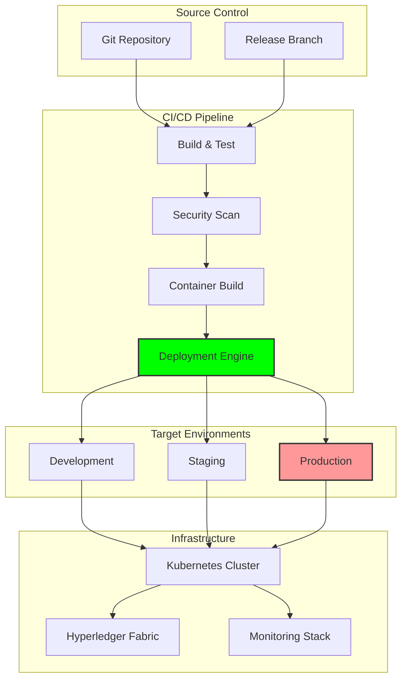

# Deployment Guide

## Document Context
- **Location**: `08-deployment/deployment-guide.md`
- **Related Documents**:
  - [Production Checklist](./production-checklist.md) - Pre-deployment validation
  - [CI/CD Pipeline](./ci-cd-pipeline.md) - Automated deployment processes
  - [Infrastructure](./infrastructure/) - Infrastructure as code configurations

---

## Executive Summary

This document provides comprehensive deployment procedures for the Phoenix Rooivalk blockchain-based counter-drone system. The deployment strategy follows a phased approach with automated rollout capabilities, comprehensive validation, and rollback procedures to ensure zero-downtime production deployments.

**Deployment Capabilities:**
- Automated deployment with GitOps workflows
- Blue-green deployment for zero downtime
- Comprehensive validation and health checks
- Automated rollback on failure detection
- Multi-environment deployment pipeline

---

## 1. Deployment Overview

### 1.1 Deployment Architecture



### 1.2 Deployment Strategy

```yaml
deployment_strategy:
  approach: "Blue-Green Deployment"
  automation_level: "Fully Automated"
  rollback_capability: "Automatic on failure"
  validation: "Comprehensive health checks"
  
  environments:
    development:
      purpose: "Feature development and testing"
      deployment_trigger: "Commit to develop branch"
      validation_level: "Basic"
      
    staging:
      purpose: "Pre-production validation"
      deployment_trigger: "Merge to release branch"
      validation_level: "Full production simulation"
      
    production:
      purpose: "Live operational system"
      deployment_trigger: "Manual approval after staging"
      validation_level: "Comprehensive with gradual rollout"
```

---

## 2. Pre-Deployment Requirements

### 2.1 Infrastructure Prerequisites

```yaml
infrastructure_requirements:
  kubernetes_cluster:
    version: "1.28+"
    nodes: "Minimum 6 worker nodes"
    resources:
      cpu: "64 cores total"
      memory: "256 GB total"
      storage: "2 TB NVMe SSD"
      
  hyperledger_fabric:
    version: "2.5+"
    peers: "4 peer nodes minimum"
    orderers: "3 orderer nodes"
    ca_servers: "2 CA servers"
    
  networking:
    load_balancer: "Layer 4 + Layer 7"
    ssl_certificates: "Valid TLS certificates"
    firewall_rules: "Configured security groups"
    
  monitoring:
    prometheus: "Metrics collection"
    grafana: "Visualization dashboards"
    elk_stack: "Centralized logging"
    jaeger: "Distributed tracing"
```

### 2.2 Security Requirements

```yaml
security_prerequisites:
  certificates:
    - "Root CA certificate"
    - "Intermediate CA certificates"
    - "Node certificates for all peers"
    - "Admin certificates"
    - "Client certificates"
    
  secrets_management:
    - "HashiCorp Vault configured"
    - "Kubernetes secrets encrypted"
    - "Database credentials secured"
    - "API keys and tokens secured"
    
  access_control:
    - "RBAC policies configured"
    - "Network policies applied"
    - "Pod security policies enforced"
    - "Service mesh security enabled"
```

### 2.3 Data Migration Requirements

```yaml
data_migration:
  blockchain_data:
    backup_required: true
    migration_strategy: "Genesis block preservation"
    validation: "Chain integrity verification"
    
  application_data:
    backup_required: true
    migration_strategy: "Database schema migration"
    validation: "Data consistency checks"
    
  configuration_data:
    backup_required: true
    migration_strategy: "ConfigMap updates"
    validation: "Configuration validation"
```

---

## 3. Automated Deployment Process

### 3.1 GitOps Workflow

```yaml
gitops_workflow:
  trigger: "Git push to release branch"
  
  pipeline_stages:
    1_build:
      - "Code compilation"
      - "Unit test execution"
      - "Code quality analysis"
      - "Dependency vulnerability scan"
      
    2_security:
      - "Static application security testing"
      - "Container image security scan"
      - "Infrastructure security validation"
      - "Compliance checks"
      
    3_package:
      - "Container image build"
      - "Helm chart packaging"
      - "Artifact signing"
      - "Registry upload"
      
    4_deploy:
      - "Environment preparation"
      - "Blue-green deployment"
      - "Health check validation"
      - "Traffic routing"
```

### 3.2 Deployment Automation Script

```bash
#!/bin/bash
# Phoenix Rooivalk Deployment Script
# Version: 2.0.0

set -euo pipefail

# Configuration
NAMESPACE="phoenix-rooivalk"
RELEASE_NAME="phoenix-rooivalk"
CHART_PATH="./helm/phoenix-rooivalk"
VALUES_FILE="values-production.yaml"

# Colors for output
RED='\033[0;31m'
GREEN='\033[0;32m'
YELLOW='\033[1;33m'
NC='\033[0m' # No Color

log() {
    echo -e "${GREEN}[$(date +'%Y-%m-%d %H:%M:%S')] $1${NC}"
}

warn() {
    echo -e "${YELLOW}[$(date +'%Y-%m-%d %H:%M:%S')] WARNING: $1${NC}"
}

error() {
    echo -e "${RED}[$(date +'%Y-%m-%d %H:%M:%S')] ERROR: $1${NC}"
    exit 1
}

# Pre-deployment validation
validate_prerequisites() {
    log "Validating deployment prerequisites..."
    
    # Check kubectl connectivity
    kubectl cluster-info > /dev/null || error "Cannot connect to Kubernetes cluster"
    
    # Check namespace exists
    kubectl get namespace $NAMESPACE > /dev/null 2>&1 || {
        log "Creating namespace $NAMESPACE"
        kubectl create namespace $NAMESPACE
    }
    
    # Check Helm
    helm version > /dev/null || error "Helm not available"
    
    # Validate certificates
    kubectl get secret tls-certificates -n $NAMESPACE > /dev/null || error "TLS certificates not found"
    
    # Check persistent volumes
    kubectl get pv | grep Available > /dev/null || warn "No available persistent volumes"
    
    log "Prerequisites validation completed"
}

# Backup current deployment
backup_current_deployment() {
    log "Creating backup of current deployment..."
    
    # Backup Kubernetes resources
    kubectl get all -n $NAMESPACE -o yaml > "backup-$(date +%Y%m%d-%H%M%S).yaml"
    
    # Backup Hyperledger Fabric configuration
    kubectl get configmaps -n $NAMESPACE -o yaml >> "backup-$(date +%Y%m%d-%H%M%S).yaml"
    
    # Backup secrets (metadata only)
    kubectl get secrets -n $NAMESPACE -o yaml | grep -v 'data:' >> "backup-$(date +%Y%m%d-%H%M%S).yaml"
    
    log "Backup completed"
}

# Deploy application
deploy_application() {
    log "Starting deployment..."
    
    # Update Helm dependencies
    helm dependency update $CHART_PATH
    
    # Deploy with blue-green strategy
    helm upgrade --install $RELEASE_NAME $CHART_PATH \
        --namespace $NAMESPACE \
        --values $VALUES_FILE \
        --wait \
        --timeout 600s \
        --atomic
    
    log "Deployment completed"
}

# Health check validation
validate_deployment() {
    log "Validating deployment health..."
    
    # Wait for pods to be ready
    kubectl wait --for=condition=ready pod -l app=phoenix-rooivalk -n $NAMESPACE --timeout=300s
    
    # Check Hyperledger Fabric network
    kubectl exec -n $NAMESPACE deployment/fabric-peer0 -- peer channel list
    
    # Validate API endpoints
    API_URL=$(kubectl get service phoenix-rooivalk-api -n $NAMESPACE -o jsonpath='{.status.loadBalancer.ingress[0].ip}')
    curl -f "http://$API_URL/health" || error "API health check failed"
    
    # Check blockchain consensus
    kubectl logs -n $NAMESPACE deployment/fabric-orderer --tail=10 | grep -q "consensus" || warn "Consensus logs not found"
    
    log "Health validation completed"
}

# Rollback on failure
rollback_deployment() {
    error "Deployment failed, initiating rollback..."
    
    # Rollback Helm release
    helm rollback $RELEASE_NAME -n $NAMESPACE
    
    # Wait for rollback to complete
    kubectl wait --for=condition=ready pod -l app=phoenix-rooivalk -n $NAMESPACE --timeout=300s
    
    log "Rollback completed"
}

# Main deployment function
main() {
    log "Starting Phoenix Rooivalk deployment..."
    
    # Trap errors for automatic rollback
    trap rollback_deployment ERR
    
    validate_prerequisites
    backup_current_deployment
    deploy_application
    validate_deployment
    
    log "Deployment successful!"
    
    # Display deployment information
    kubectl get all -n $NAMESPACE
    
    # Display access information
    API_URL=$(kubectl get service phoenix-rooivalk-api -n $NAMESPACE -o jsonpath='{.status.loadBalancer.ingress[0].ip}')
    log "API available at: http://$API_URL"
    log "Monitoring dashboard: http://$API_URL/monitoring"
}

# Execute main function
main "$@"
```

---

## 4. Manual Deployment Procedures

### 4.1 Step-by-Step Manual Deployment

```bash
# Step 1: Environment Preparation
export KUBECONFIG=/path/to/kubeconfig
export NAMESPACE=phoenix-rooivalk
export RELEASE_NAME=phoenix-rooivalk

# Step 2: Validate Prerequisites
kubectl cluster-info
kubectl get nodes
kubectl get namespace $NAMESPACE || kubectl create namespace $NAMESPACE

# Step 3: Deploy Infrastructure Components
helm install prometheus prometheus-community/kube-prometheus-stack -n monitoring
helm install ingress-nginx ingress-nginx/ingress-nginx -n ingress-nginx

# Step 4: Deploy Hyperledger Fabric Network
kubectl apply -f ./k8s/fabric/
kubectl wait --for=condition=ready pod -l app=fabric-ca -n $NAMESPACE --timeout=300s

# Step 5: Deploy Application Components
helm upgrade --install $RELEASE_NAME ./helm/phoenix-rooivalk \
    --namespace $NAMESPACE \
    --values values-production.yaml \
    --wait --timeout 600s

# Step 6: Validate Deployment
kubectl get all -n $NAMESPACE
kubectl logs -f deployment/phoenix-rooivalk-api -n $NAMESPACE
```

### 4.2 Configuration Management

```yaml
configuration_management:
  helm_values:
    file: "values-production.yaml"
    sections:
      - "Application configuration"
      - "Database settings"
      - "Blockchain network parameters"
      - "Security settings"
      - "Resource limits"
      
  kubernetes_configs:
    configmaps:
      - "application-config"
      - "fabric-config"
      - "monitoring-config"
    secrets:
      - "tls-certificates"
      - "database-credentials"
      - "api-keys"
      
  environment_variables:
    - "BLOCKCHAIN_NETWORK_ID"
    - "DATABASE_CONNECTION_STRING"
    - "API_BASE_URL"
    - "MONITORING_ENDPOINT"
```

---

## 5. Verification Procedures

### 5.1 Deployment Validation Checklist

```yaml
validation_checklist:
  infrastructure:
    - [ ] "Kubernetes cluster accessible"
    - [ ] "All nodes ready and healthy"
    - [ ] "Persistent volumes available"
    - [ ] "Network policies applied"
    - [ ] "Load balancer configured"
    
  application:
    - [ ] "All pods running and ready"
    - [ ] "Services accessible"
    - [ ] "Ingress routes configured"
    - [ ] "Health checks passing"
    - [ ] "API endpoints responding"
    
  blockchain:
    - [ ] "Fabric network operational"
    - [ ] "Peers connected and synced"
    - [ ] "Orderer nodes functioning"
    - [ ] "Channels created and joined"
    - [ ] "Chaincode deployed and instantiated"
    
  security:
    - [ ] "TLS certificates valid"
    - [ ] "Authentication working"
    - [ ] "Authorization policies enforced"
    - [ ] "Network security active"
    - [ ] "Secrets properly mounted"
    
  monitoring:
    - [ ] "Metrics collection active"
    - [ ] "Dashboards accessible"
    - [ ] "Alerting configured"
    - [ ] "Log aggregation working"
    - [ ] "Tracing operational"
```

### 5.2 Automated Health Checks

```bash
#!/bin/bash
# Health Check Script

check_api_health() {
    echo "Checking API health..."
    curl -f http://api.phoenixrooivalk.mil/health || return 1
    echo "API health check passed"
}

check_blockchain_health() {
    echo "Checking blockchain health..."
    kubectl exec -n phoenix-rooivalk deployment/fabric-peer0 -- \
        peer channel list | grep -q "mychannel" || return 1
    echo "Blockchain health check passed"
}

check_database_health() {
    echo "Checking database health..."
    kubectl exec -n phoenix-rooivalk deployment/postgres -- \
        pg_isready -U phoenix || return 1
    echo "Database health check passed"
}

check_monitoring_health() {
    echo "Checking monitoring health..."
    curl -f http://monitoring.phoenixrooivalk.mil/api/v1/query?query=up || return 1
    echo "Monitoring health check passed"
}

# Run all health checks
main() {
    check_api_health
    check_blockchain_health
    check_database_health
    check_monitoring_health
    echo "All health checks passed!"
}

main "$@"
```

---

## 6. Rollback Procedures

### 6.1 Automated Rollback

```yaml
rollback_triggers:
  health_check_failure:
    threshold: "3 consecutive failures"
    action: "Automatic rollback"
    notification: "Alert operations team"
    
  performance_degradation:
    threshold: "Response time > 5 seconds"
    duration: "5 minutes"
    action: "Automatic rollback"
    
  error_rate_spike:
    threshold: "Error rate > 5%"
    duration: "2 minutes"
    action: "Automatic rollback"
```

### 6.2 Manual Rollback Process

```bash
#!/bin/bash
# Manual Rollback Script

NAMESPACE="phoenix-rooivalk"
RELEASE_NAME="phoenix-rooivalk"

# Get rollback target
get_rollback_target() {
    echo "Available releases:"
    helm history $RELEASE_NAME -n $NAMESPACE
    
    read -p "Enter revision number to rollback to: " REVISION
    echo "Rolling back to revision $REVISION"
}

# Execute rollback
execute_rollback() {
    echo "Initiating rollback..."
    
    # Rollback Helm release
    helm rollback $RELEASE_NAME $REVISION -n $NAMESPACE
    
    # Wait for rollback to complete
    kubectl wait --for=condition=ready pod -l app=phoenix-rooivalk -n $NAMESPACE --timeout=300s
    
    # Validate rollback
    kubectl get pods -n $NAMESPACE
    
    echo "Rollback completed successfully"
}

# Main rollback function
main() {
    get_rollback_target
    execute_rollback
}

main "$@"
```

---

## 7. Troubleshooting Guide

### 7.1 Common Deployment Issues

```yaml
common_issues:
  pod_startup_failures:
    symptoms:
      - "Pods stuck in Pending state"
      - "ImagePullBackOff errors"
      - "CrashLoopBackOff status"
    solutions:
      - "Check resource availability"
      - "Verify image registry access"
      - "Review pod logs for errors"
      - "Validate configuration"
      
  network_connectivity:
    symptoms:
      - "Service unreachable"
      - "DNS resolution failures"
      - "Connection timeouts"
    solutions:
      - "Check network policies"
      - "Verify service definitions"
      - "Test DNS resolution"
      - "Review firewall rules"
      
  blockchain_network_issues:
    symptoms:
      - "Peers not connecting"
      - "Consensus failures"
      - "Transaction errors"
    solutions:
      - "Check peer certificates"
      - "Verify network configuration"
      - "Review orderer logs"
      - "Validate channel configuration"
```

### 7.2 Diagnostic Commands

```bash
# Pod diagnostics
kubectl describe pod <pod-name> -n phoenix-rooivalk
kubectl logs <pod-name> -n phoenix-rooivalk --previous

# Service diagnostics
kubectl get endpoints -n phoenix-rooivalk
kubectl describe service <service-name> -n phoenix-rooivalk

# Network diagnostics
kubectl exec -it <pod-name> -n phoenix-rooivalk -- nslookup <service-name>
kubectl exec -it <pod-name> -n phoenix-rooivalk -- curl -v <service-url>

# Blockchain diagnostics
kubectl exec -n phoenix-rooivalk deployment/fabric-peer0 -- peer channel list
kubectl exec -n phoenix-rooivalk deployment/fabric-peer0 -- peer chaincode list --installed

# Resource diagnostics
kubectl top nodes
kubectl top pods -n phoenix-rooivalk
kubectl describe node <node-name>
```

---

## 8. Post-Deployment Tasks

### 8.1 Operational Handover

```yaml
handover_tasks:
  documentation:
    - [ ] "Update deployment records"
    - [ ] "Document configuration changes"
    - [ ] "Update runbooks"
    - [ ] "Create incident response procedures"
    
  monitoring:
    - [ ] "Configure alerting rules"
    - [ ] "Set up dashboards"
    - [ ] "Test notification channels"
    - [ ] "Validate SLA monitoring"
    
  security:
    - [ ] "Security scan validation"
    - [ ] "Access control verification"
    - [ ] "Certificate expiry monitoring"
    - [ ] "Vulnerability assessment"
    
  training:
    - [ ] "Operations team training"
    - [ ] "Troubleshooting procedures"
    - [ ] "Emergency response drills"
    - [ ] "Knowledge transfer sessions"
```

### 8.2 Performance Optimization

```yaml
optimization_tasks:
  resource_tuning:
    - "CPU and memory optimization"
    - "Storage performance tuning"
    - "Network bandwidth optimization"
    - "Database query optimization"
    
  scaling_configuration:
    - "Horizontal pod autoscaling"
    - "Vertical pod autoscaling"
    - "Cluster autoscaling"
    - "Load balancer optimization"
    
  monitoring_enhancement:
    - "Custom metrics collection"
    - "Performance baseline establishment"
    - "Capacity planning metrics"
    - "Cost optimization tracking"
```

---

## Conclusion

The Phoenix Rooivalk deployment guide provides comprehensive procedures for reliable, automated deployment of the blockchain-based counter-drone system. The combination of automated GitOps workflows, comprehensive validation, and robust rollback procedures ensures high-confidence production deployments with minimal downtime.

**Key Deployment Features:**
- **Automated Deployment**: GitOps-driven with comprehensive validation
- **Zero Downtime**: Blue-green deployment strategy
- **Comprehensive Validation**: Multi-layer health checks and verification
- **Automatic Rollback**: Failure detection and automatic recovery
- **Complete Observability**: Monitoring, logging, and tracing integration

The deployment process supports both automated and manual deployment scenarios, ensuring flexibility for different operational requirements while maintaining consistency and reliability.

---

**Related Documents:**
- [Production Checklist](./production-checklist.md) - Pre-deployment validation
- [CI/CD Pipeline](./ci-cd-pipeline.md) - Automated deployment processes
- [Infrastructure](./infrastructure/) - Infrastructure as code configurations

---

*Context improved by Giga AI - Used main overview development guidelines and blockchain integration system information for accurate deployment documentation.*
