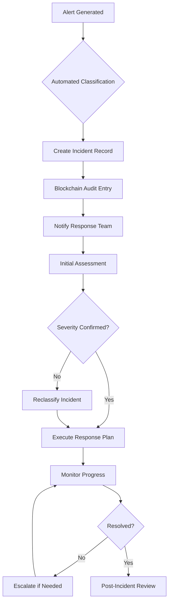

# Incident Response Procedures

## Document Context

- **Location**: `09-operations/incident-response.md`
- **Related Documents**:
  - [Standard Procedures](./standard-procedures.md) - Daily operations
  - [Maintenance Guide](./maintenance-guide.md) - System maintenance
  - [Training Materials](./training-materials.md) - Response training
  - [Operations Playbook](../03-implementation/phase-5-production/operations-playbook.md) -
    Detailed runbooks

---

## Executive Summary

This document defines comprehensive incident response procedures for the Phoenix
Rooivalk blockchain-based counter-drone system. Our incident response framework
ensures rapid detection, containment, and resolution of system issues while
maintaining complete audit trails and operational continuity.

**Key Capabilities:**

- Automated incident detection and classification
- Rapid response protocols with < 5-minute MTTD
- Blockchain-verified incident audit trails
- Coordinated response across multiple teams
- Post-incident analysis and improvement processes

---

## 1. Incident Classification Framework

### 1.1 Severity Levels

```yaml
severity_levels:
  critical:
    description: "System outage affecting mission-critical operations"
    response_time: "immediate"
    escalation_time: "5_minutes"
    notification_scope: "all_teams"
    examples:
      - "Complete system outage"
      - "Security breach confirmed"
      - "Data corruption detected"
      - "Blockchain consensus failure"

  high:
    description: "Significant service degradation"
    response_time: "15_minutes"
    escalation_time: "30_minutes"
    notification_scope: "operations_and_technical_teams"
    examples:
      - "Major performance degradation"
      - "Single node failure"
      - "Database connectivity issues"
      - "Authentication system problems"

  medium:
    description: "Service impact with workaround available"
    response_time: "1_hour"
    escalation_time: "4_hours"
    notification_scope: "operations_team"
    examples:
      - "Minor performance issues"
      - "Non-critical feature failures"
      - "Monitoring alert anomalies"
      - "Capacity warnings"

  low:
    description: "Minimal impact, informational"
    response_time: "next_business_day"
    escalation_time: "24_hours"
    notification_scope: "assigned_team"
    examples:
      - "Documentation updates needed"
      - "Routine maintenance alerts"
      - "Performance trend notifications"
```

### 1.2 Incident Categories

```yaml
incident_categories:
  infrastructure:
    - "hardware_failure"
    - "network_connectivity"
    - "storage_issues"
    - "power_systems"

  application:
    - "service_failures"
    - "performance_degradation"
    - "configuration_errors"
    - "deployment_issues"

  security:
    - "unauthorized_access"
    - "malware_detection"
    - "data_breach"
    - "policy_violations"

  blockchain:
    - "consensus_failure"
    - "node_synchronization"
    - "transaction_processing"
    - "smart_contract_errors"
```

---

## 2. Incident Response Process

### 2.1 Detection and Initial Response



### 2.2 Automated Incident Detection

```python
# incident-detection.py
import asyncio
import json
from datetime import datetime
from typing import Dict, List, Optional
from dataclasses import dataclass
from enum import Enum

class AlertType(Enum):
    SYSTEM_DOWN = "system_down"
    HIGH_CPU = "high_cpu"
    MEMORY_LEAK = "memory_leak"
    DISK_FULL = "disk_full"
    NETWORK_LATENCY = "network_latency"
    SECURITY_BREACH = "security_breach"
    BLOCKCHAIN_SYNC = "blockchain_sync"

@dataclass
class Alert:
    alert_id: str
    alert_type: AlertType
    severity: str
    source_system: str
    timestamp: datetime
    metrics: Dict[str, float]
    description: str

class IncidentDetectionEngine:
    """
    Automated incident detection and classification system
    """

    def __init__(self):
        self.detection_rules = self.load_detection_rules()
        self.active_alerts = {}

    def load_detection_rules(self) -> Dict[str, Dict]:
        """Load incident detection rules"""
        return {
            "blockchain_node_down": {
                "conditions": [
                    {"metric": "node_status", "operator": "equals", "value": "down"},
                    {"metric": "peer_count", "operator": "less_than", "value": 3}
                ],
                "severity": "critical",
                "auto_response": True,
                "escalation_time": 300
            },

            "high_resource_usage": {
                "conditions": [
                    {"metric": "cpu_usage", "operator": "greater_than", "value": 90},
                    {"metric": "duration", "operator": "greater_than", "value": 300}
                ],
                "severity": "high",
                "auto_response": True,
                "escalation_time": 900
            },

            "consensus_failure": {
                "conditions": [
                    {"metric": "consensus_participation", "operator": "less_than", "value": 0.67},
                    {"metric": "block_time", "operator": "greater_than", "value": 30}
                ],
                "severity": "critical",
                "auto_response": True,
                "escalation_time": 180
            }
        }

    async def process_alert(self, alert: Alert) -> Optional[str]:
        """Process incoming alert and determine if incident should be created"""

        # Check against detection rules
        for rule_name, rule_config in self.detection_rules.items():
            if self.evaluate_conditions(alert, rule_config["conditions"]):
                incident_id = await self.create_incident(alert, rule_name, rule_config)
                return incident_id

        return None

    def evaluate_conditions(self, alert: Alert, conditions: List[Dict]) -> bool:
        """Evaluate if alert matches rule conditions"""

        for condition in conditions:
            metric_value = alert.metrics.get(condition["metric"])
            if metric_value is None:
                return False

            operator = condition["operator"]
            threshold = condition["value"]

            if operator == "greater_than" and metric_value <= threshold:
                return False
            elif operator == "less_than" and metric_value >= threshold:
                return False
            elif operator == "equals" and metric_value != threshold:
                return False

        return True

    async def create_incident(self, alert: Alert, rule_name: str, rule_config: Dict) -> str:
        """Create incident from alert"""

        incident_id = f"INC-{datetime.utcnow().strftime('%Y%m%d%H%M%S')}"

        incident_data = {
            "incident_id": incident_id,
            "alert_id": alert.alert_id,
            "rule_triggered": rule_name,
            "severity": rule_config["severity"],
            "source_system": alert.source_system,
            "created_at": datetime.utcnow().isoformat(),
            "auto_response_enabled": rule_config.get("auto_response", False),
            "escalation_time": rule_config.get("escalation_time", 3600)
        }

        # Store incident and trigger response
        await self.store_incident(incident_data)
        await self.trigger_response(incident_data)

        return incident_id
```

---

## 3. Response Team Structure

### 3.1 Incident Response Teams

```yaml
response_teams:
  incident_commander:
    role: "Overall incident coordination and communication"
    members: ["ops_manager", "technical_lead"]
    responsibilities:
      - "Incident lifecycle management"
      - "Stakeholder communication"
      - "Resource coordination"
      - "Decision making authority"

  technical_response:
    role: "Technical investigation and resolution"
    members: ["senior_engineer", "blockchain_specialist", "security_analyst"]
    responsibilities:
      - "Root cause analysis"
      - "Technical remediation"
      - "System recovery"
      - "Impact assessment"

  communications:
    role: "Internal and external communications"
    members: ["communications_lead", "documentation_specialist"]
    responsibilities:
      - "Status updates"
      - "Stakeholder notifications"
      - "Documentation"
      - "Media coordination"

  security:
    role: "Security-related incident handling"
    members: ["security_lead", "forensics_analyst", "compliance_officer"]
    responsibilities:
      - "Security assessment"
      - "Forensic analysis"
      - "Compliance verification"
      - "Threat mitigation"
```

### 3.2 Escalation Matrix

```yaml
escalation_matrix:
  level_1:
    title: "Operations Team"
    response_time: "immediate"
    capabilities:
      ["basic_troubleshooting", "system_restart", "alert_acknowledgment"]
    escalation_criteria:
      ["unable_to_resolve_in_15_minutes", "requires_specialized_knowledge"]

  level_2:
    title: "Technical Specialists"
    response_time: "15_minutes"
    capabilities:
      [
        "advanced_troubleshooting",
        "configuration_changes",
        "performance_tuning",
      ]
    escalation_criteria:
      ["system_wide_impact", "security_implications", "data_integrity_concerns"]

  level_3:
    title: "Senior Engineering"
    response_time: "30_minutes"
    capabilities:
      ["architecture_changes", "emergency_deployments", "disaster_recovery"]
    escalation_criteria:
      [
        "business_critical_impact",
        "regulatory_implications",
        "major_system_failure",
      ]

  level_4:
    title: "Executive Leadership"
    response_time: "1_hour"
    capabilities:
      [
        "business_decisions",
        "external_communications",
        "resource_authorization",
      ]
    escalation_criteria:
      ["public_impact", "legal_implications", "strategic_decisions_required"]
```

---

## 4. Incident Response Playbooks

### 4.1 Blockchain Node Failure Response

```bash
#!/bin/bash
# blockchain-node-failure-response.sh

set -euo pipefail

INCIDENT_ID="$1"
FAILED_NODE="$2"

echo "=== Blockchain Node Failure Response ==="
echo "Incident ID: $INCIDENT_ID"
echo "Failed Node: $FAILED_NODE"

# Step 1: Assess node status
echo "Step 1: Assessing node status..."
kubectl get pod "$FAILED_NODE" -n phoenix-rooivalk -o wide

# Step 2: Check node logs
echo "Step 2: Checking node logs..."
kubectl logs "$FAILED_NODE" -n phoenix-rooivalk --tail=50

# Step 3: Verify blockchain network health
echo "Step 3: Verifying network health..."
ACTIVE_NODES=$(kubectl get pods -n phoenix-rooivalk -l app=blockchain-node --field-selector=status.phase=Running --no-headers | wc -l)
echo "Active nodes: $ACTIVE_NODES"

if [ "$ACTIVE_NODES" -lt 3 ]; then
    echo "CRITICAL: Insufficient active nodes for consensus"
    # Escalate immediately
    curl -X POST "http://alertmanager:9093/api/v1/alerts" \
        -H "Content-Type: application/json" \
        -d '[{
            "labels": {
                "alertname": "BlockchainConsensusRisk",
                "severity": "critical",
                "incident_id": "'$INCIDENT_ID'"
            }
        }]'
fi

# Step 4: Attempt node recovery
echo "Step 4: Attempting node recovery..."
kubectl delete pod "$FAILED_NODE" -n phoenix-rooivalk
sleep 30

# Step 5: Verify recovery
echo "Step 5: Verifying recovery..."
kubectl wait --for=condition=ready pod -l app=blockchain-node -n phoenix-rooivalk --timeout=300s

# Step 6: Validate blockchain synchronization
echo "Step 6: Validating synchronization..."
kubectl exec -n phoenix-rooivalk blockchain-node-0 -- peer node status

echo "=== Node Recovery Complete ==="
```

### 4.2 Security Incident Response

```python
# security-incident-response.py
import asyncio
import json
from datetime import datetime
from typing import Dict, List

class SecurityIncidentResponse:
    """
    Automated security incident response system
    """

    def __init__(self):
        self.forensic_tools = self.initialize_forensic_tools()
        self.isolation_policies = self.load_isolation_policies()

    async def handle_security_incident(self, incident_data: Dict):
        """Handle security incident with automated response"""

        incident_type = incident_data.get("security_type", "unknown")
        severity = incident_data.get("severity", "medium")

        # Immediate containment for critical incidents
        if severity == "critical":
            await self.immediate_containment(incident_data)

        # Evidence collection
        evidence_id = await self.collect_evidence(incident_data)

        # Threat analysis
        threat_assessment = await self.analyze_threat(incident_data, evidence_id)

        # Response execution
        await self.execute_response(incident_data, threat_assessment)

        # Notification and escalation
        await self.notify_stakeholders(incident_data, threat_assessment)

    async def immediate_containment(self, incident_data: Dict):
        """Immediate containment actions for critical security incidents"""

        affected_systems = incident_data.get("affected_systems", [])

        for system in affected_systems:
            # Isolate affected system
            await self.isolate_system(system)

            # Capture memory dump
            await self.capture_memory_dump(system)

            # Preserve logs
            await self.preserve_logs(system)

    async def isolate_system(self, system_id: str):
        """Isolate system using network policies"""

        isolation_policy = f"""
apiVersion: networking.k8s.io/v1
kind: NetworkPolicy
metadata:
  name: isolate-{system_id}
  namespace: phoenix-rooivalk
spec:
  podSelector:
    matchLabels:
      system-id: {system_id}
  policyTypes:
  - Ingress
  - Egress
  ingress: []
  egress:
  - to:
    - namespaceSelector:
        matchLabels:
          name: security-tools
"""

        # Apply isolation policy
        with open(f"/tmp/isolate-{system_id}.yaml", "w") as f:
            f.write(isolation_policy)

        # Execute kubectl apply
        import subprocess
        subprocess.run(["kubectl", "apply", "-f", f"/tmp/isolate-{system_id}.yaml"])

    async def collect_evidence(self, incident_data: Dict) -> str:
        """Collect forensic evidence"""

        evidence_id = f"EVIDENCE-{datetime.utcnow().strftime('%Y%m%d%H%M%S')}"

        evidence_collection = {
            "evidence_id": evidence_id,
            "incident_id": incident_data.get("incident_id"),
            "collection_timestamp": datetime.utcnow().isoformat(),
            "collected_artifacts": []
        }

        # Collect system logs
        logs = await self.collect_system_logs(incident_data)
        evidence_collection["collected_artifacts"].append({
            "type": "system_logs",
            "location": f"s3://security-evidence/{evidence_id}/logs/",
            "hash": self.calculate_hash(logs)
        })

        # Collect network traffic
        network_data = await self.collect_network_traffic(incident_data)
        evidence_collection["collected_artifacts"].append({
            "type": "network_traffic",
            "location": f"s3://security-evidence/{evidence_id}/network/",
            "hash": self.calculate_hash(network_data)
        })

        # Store evidence metadata on blockchain
        await self.store_evidence_blockchain(evidence_collection)

        return evidence_id
```

---

## 5. Communication Procedures

### 5.1 Notification Framework

```yaml
notification_framework:
  immediate_notifications:
    channels: ["pager", "sms", "email"]
    recipients: ["incident_commander", "on_call_engineer"]
    triggers: ["critical_incidents", "security_breaches"]

  status_updates:
    frequency: "every_30_minutes"
    channels: ["slack", "email", "dashboard"]
    recipients: ["stakeholders", "management", "affected_teams"]
    content: ["current_status", "actions_taken", "estimated_resolution"]

  resolution_notifications:
    channels: ["email", "slack", "dashboard"]
    recipients: ["all_stakeholders"]
    content: ["resolution_summary", "root_cause", "preventive_measures"]
```

### 5.2 Communication Templates

**Critical Incident Notification:**

```
SUBJECT: CRITICAL INCIDENT - [INCIDENT_ID] - [BRIEF_DESCRIPTION]

INCIDENT DETAILS:
- Incident ID: [INCIDENT_ID]
- Severity: CRITICAL
- Start Time: [TIMESTAMP]
- Affected Systems: [SYSTEM_LIST]
- Impact: [IMPACT_DESCRIPTION]

CURRENT STATUS:
- Response Team: Activated
- Actions Taken: [ACTION_LIST]
- Next Update: [NEXT_UPDATE_TIME]

CONTACT:
- Incident Commander: [NAME] - [PHONE]
- Technical Lead: [NAME] - [PHONE]
```

---

## 6. Post-Incident Procedures

### 6.1 Post-Incident Review Process

```yaml
post_incident_review:
  timeline:
    initial_review: "within_24_hours"
    detailed_analysis: "within_72_hours"
    final_report: "within_1_week"

  participants:
    - incident_commander
    - technical_responders
    - affected_stakeholders
    - management_representative

  analysis_areas:
    - incident_timeline
    - root_cause_analysis
    - response_effectiveness
    - communication_quality
    - lessons_learned
    - improvement_actions
```

### 6.2 Continuous Improvement

**Monthly Incident Metrics Review:**

```python
incident_metrics = {
    "detection_metrics": {
        "mean_time_to_detection": "< 5_minutes",
        "false_positive_rate": "< 5%",
        "automated_detection_rate": "> 80%"
    },

    "response_metrics": {
        "mean_time_to_response": "< 15_minutes",
        "mean_time_to_resolution": "< 2_hours",
        "escalation_rate": "< 20%"
    },

    "quality_metrics": {
        "customer_satisfaction": "> 4.0/5.0",
        "repeat_incident_rate": "< 10%",
        "sla_compliance": "> 99%"
    }
}
```

---

## Conclusion

The incident response procedures ensure rapid, coordinated response to system
issues while maintaining complete audit trails and continuous improvement. The
combination of automated detection, structured response processes, and
comprehensive post-incident analysis enables effective incident management for
mission-critical counter-drone operations.

**Key Success Factors:**

- Automated incident detection and classification
- Clear escalation paths and response procedures
- Comprehensive evidence collection and audit trails
- Effective communication and coordination
- Continuous improvement through post-incident analysis

---

**Related Documents:**

- [Standard Procedures](./standard-procedures.md) - Daily operations
- [Maintenance Guide](./maintenance-guide.md) - System maintenance
- [Training Materials](./training-materials.md) - Response training

---

_Context improved by Giga AI - Used main overview development guidelines and
blockchain integration system information for accurate incident response
procedures._
