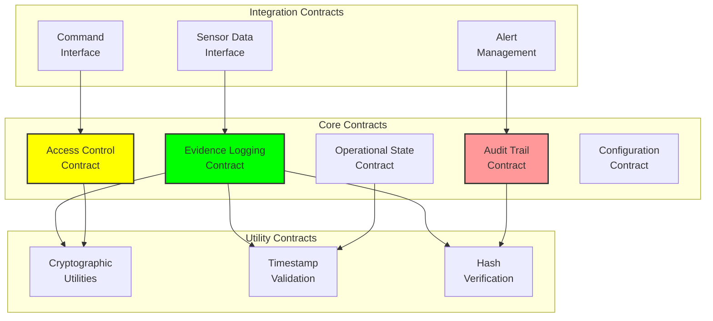

# Smart Contracts Technical Reference

## Document Context

- **Location**: `10-appendices/technical-reference/smart-contracts.md`
- **Related Documents**:
  - [API Documentation](./api-documentation.md) - REST API reference
  - [Code Examples](./code-examples.md) - Implementation examples
  - [System Architecture](../../02-technical-architecture/blockchain-architecture.md) -
    Architecture overview

---

## Executive Summary

This document provides comprehensive technical reference for all smart contracts
deployed in the Phoenix Rooivalk blockchain-based counter-drone system. Our
smart contract architecture implements immutable audit trails, evidence
anchoring, and operational transparency while maintaining high performance and
security standards.

**Key Smart Contracts:**

- Evidence Logging Contract - Immutable event recording
- Access Control Contract - Permission management
- Operational State Contract - System state management
- Audit Trail Contract - Complete operational history
- Configuration Management Contract - System configuration

---

## 1. Contract Architecture Overview

### 1.1 Contract Hierarchy



### 1.2 Contract Deployment Structure

```yaml
contract_deployment:
  network: "phoenix-rooivalk-chain"
  consensus: "proof-of-authority"
  gas_limit: 8000000

  contracts:
    evidence_logging:
      address: "0x1234567890abcdef1234567890abcdef12345678"
      version: "v2.1.0"
      deployed_block: 1000

    access_control:
      address: "0x2345678901bcdef12345678901bcdef123456789"
      version: "v2.0.0"
      deployed_block: 1001

    operational_state:
      address: "0x3456789012cdef123456789012cdef1234567890"
      version: "v1.5.0"
      deployed_block: 1002
```

---

## 2. Evidence Logging Contract

### 2.1 Contract Interface

```solidity
// SPDX-License-Identifier: MIT
pragma solidity ^0.8.19;

/**
 * @title EvidenceLogging
 * @dev Immutable evidence logging for counter-drone operations
 */
contract EvidenceLogging {

    struct EvidenceRecord {
        bytes32 evidenceHash;
        uint256 timestamp;
        address submitter;
        string evidenceType;
        string metadata;
        bytes32 previousHash;
        bool verified;
    }

    struct DetectionEvent {
        uint256 eventId;
        uint256 timestamp;
        string sensorId;
        string targetType;
        string coordinates;
        string threatLevel;
        bytes32 evidenceHash;
    }

    struct ResponseAction {
        uint256 actionId;
        uint256 timestamp;
        string actionType;
        string systemId;
        string parameters;
        string outcome;
        bytes32 evidenceHash;
    }

    // Events
    event EvidenceLogged(
        bytes32 indexed evidenceHash,
        address indexed submitter,
        string evidenceType,
        uint256 timestamp
    );

    event DetectionRecorded(
        uint256 indexed eventId,
        string indexed sensorId,
        string targetType,
        uint256 timestamp
    );

    event ResponseExecuted(
        uint256 indexed actionId,
        string indexed systemId,
        string actionType,
        uint256 timestamp
    );

    // State variables
    mapping(bytes32 => EvidenceRecord) public evidenceRecords;
    mapping(uint256 => DetectionEvent) public detectionEvents;
    mapping(uint256 => ResponseAction) public responseActions;

    uint256 public evidenceCount;
    uint256 public detectionCount;
    uint256 public responseCount;

    bytes32 public chainHash;

    // Access control
    mapping(address => bool) public authorizedSubmitters;
    address public owner;

    modifier onlyAuthorized() {
        require(authorizedSubmitters[msg.sender], "Unauthorized submitter");
        _;
    }

    modifier onlyOwner() {
        require(msg.sender == owner, "Only owner can execute");
        _;
    }

    constructor() {
        owner = msg.sender;
        authorizedSubmitters[msg.sender] = true;
        chainHash = keccak256(abi.encodePacked(block.timestamp, msg.sender));
    }

    /**
     * @dev Log evidence with hash chain verification
     * @param _evidenceHash SHA-256 hash of evidence data
     * @param _evidenceType Type of evidence being logged
     * @param _metadata Additional metadata in JSON format
     */
    function logEvidence(
        bytes32 _evidenceHash,
        string memory _evidenceType,
        string memory _metadata
    ) external onlyAuthorized returns (bool) {

        require(_evidenceHash != bytes32(0), "Invalid evidence hash");
        require(bytes(_evidenceType).length > 0, "Evidence type required");
        require(!evidenceRecords[_evidenceHash].verified, "Evidence already exists");

        // Create evidence record
        evidenceRecords[_evidenceHash] = EvidenceRecord({
            evidenceHash: _evidenceHash,
            timestamp: block.timestamp,
            submitter: msg.sender,
            evidenceType: _evidenceType,
            metadata: _metadata,
            previousHash: chainHash,
            verified: true
        });

        // Update chain hash
        chainHash = keccak256(abi.encodePacked(
            chainHash,
            _evidenceHash,
            block.timestamp,
            msg.sender
        ));

        evidenceCount++;

        emit EvidenceLogged(_evidenceHash, msg.sender, _evidenceType, block.timestamp);

        return true;
    }

    /**
     * @dev Record drone detection event
     * @param _sensorId Identifier of detecting sensor
     * @param _targetType Type of detected target
     * @param _coordinates GPS coordinates of detection
     * @param _threatLevel Assessed threat level
     * @param _evidenceHash Hash of associated evidence
     */
    function recordDetection(
        string memory _sensorId,
        string memory _targetType,
        string memory _coordinates,
        string memory _threatLevel,
        bytes32 _evidenceHash
    ) external onlyAuthorized returns (uint256) {

        require(bytes(_sensorId).length > 0, "Sensor ID required");
        require(evidenceRecords[_evidenceHash].verified, "Evidence must be logged first");

        uint256 eventId = detectionCount + 1;

        detectionEvents[eventId] = DetectionEvent({
            eventId: eventId,
            timestamp: block.timestamp,
            sensorId: _sensorId,
            targetType: _targetType,
            coordinates: _coordinates,
            threatLevel: _threatLevel,
            evidenceHash: _evidenceHash
        });

        detectionCount++;

        emit DetectionRecorded(eventId, _sensorId, _targetType, block.timestamp);

        return eventId;
    }

    /**
     * @dev Record response action taken
     * @param _actionType Type of response action
     * @param _systemId Identifier of responding system
     * @param _parameters Action parameters in JSON format
     * @param _outcome Result of the action
     * @param _evidenceHash Hash of associated evidence
     */
    function recordResponse(
        string memory _actionType,
        string memory _systemId,
        string memory _parameters,
        string memory _outcome,
        bytes32 _evidenceHash
    ) external onlyAuthorized returns (uint256) {

        require(bytes(_actionType).length > 0, "Action type required");
        require(evidenceRecords[_evidenceHash].verified, "Evidence must be logged first");

        uint256 actionId = responseCount + 1;

        responseActions[actionId] = ResponseAction({
            actionId: actionId,
            timestamp: block.timestamp,
            actionType: _actionType,
            systemId: _systemId,
            parameters: _parameters,
            outcome: _outcome,
            evidenceHash: _evidenceHash
        });

        responseCount++;

        emit ResponseExecuted(actionId, _systemId, _actionType, block.timestamp);

        return actionId;
    }

    /**
     * @dev Verify evidence chain integrity
     * @param _evidenceHash Hash to verify
     * @return bool True if evidence is valid and chain is intact
     */
    function verifyEvidence(bytes32 _evidenceHash) external view returns (bool) {
        return evidenceRecords[_evidenceHash].verified;
    }

    /**
     * @dev Get evidence record details
     * @param _evidenceHash Hash of evidence to retrieve
     */
    function getEvidence(bytes32 _evidenceHash) external view returns (
        bytes32 evidenceHash,
        uint256 timestamp,
        address submitter,
        string memory evidenceType,
        string memory metadata,
        bytes32 previousHash
    ) {
        EvidenceRecord memory record = evidenceRecords[_evidenceHash];
        require(record.verified, "Evidence not found");

        return (
            record.evidenceHash,
            record.timestamp,
            record.submitter,
            record.evidenceType,
            record.metadata,
            record.previousHash
        );
    }

    /**
     * @dev Add authorized submitter
     * @param _submitter Address to authorize
     */
    function addAuthorizedSubmitter(address _submitter) external onlyOwner {
        authorizedSubmitters[_submitter] = true;
    }

    /**
     * @dev Remove authorized submitter
     * @param _submitter Address to deauthorize
     */
    function removeAuthorizedSubmitter(address _submitter) external onlyOwner {
        authorizedSubmitters[_submitter] = false;
    }
}
```

### 2.2 Contract Functions Reference

```yaml
evidence_logging_functions:
  write_functions:
    logEvidence:
      description: "Log evidence with hash chain verification"
      parameters:
        - name: "_evidenceHash"
          type: "bytes32"
          description: "SHA-256 hash of evidence data"
        - name: "_evidenceType"
          type: "string"
          description: "Type of evidence (detection, response, maintenance)"
        - name: "_metadata"
          type: "string"
          description: "JSON metadata with additional context"
      gas_cost: "~85,000"

    recordDetection:
      description: "Record drone detection event"
      parameters:
        - name: "_sensorId"
          type: "string"
        - name: "_targetType"
          type: "string"
        - name: "_coordinates"
          type: "string"
        - name: "_threatLevel"
          type: "string"
        - name: "_evidenceHash"
          type: "bytes32"
      gas_cost: "~95,000"

    recordResponse:
      description: "Record response action taken"
      parameters:
        - name: "_actionType"
          type: "string"
        - name: "_systemId"
          type: "string"
        - name: "_parameters"
          type: "string"
        - name: "_outcome"
          type: "string"
        - name: "_evidenceHash"
          type: "bytes32"
      gas_cost: "~105,000"

  read_functions:
    verifyEvidence:
      description: "Verify evidence exists and is valid"
      parameters:
        - name: "_evidenceHash"
          type: "bytes32"
      returns: "bool"
      gas_cost: "~5,000"

    getEvidence:
      description: "Retrieve evidence record details"
      parameters:
        - name: "_evidenceHash"
          type: "bytes32"
      returns: "EvidenceRecord struct"
      gas_cost: "~8,000"
```

---

## 3. Access Control Contract

### 3.1 Role-Based Access Control

```solidity
// SPDX-License-Identifier: MIT
pragma solidity ^0.8.19;

/**
 * @title AccessControl
 * @dev Role-based access control for Phoenix Rooivalk system
 */
contract AccessControl {

    struct Role {
        string roleName;
        mapping(string => bool) permissions;
        bool active;
        uint256 createdAt;
    }

    struct User {
        address userAddress;
        string[] roles;
        bool active;
        uint256 lastAccess;
        string metadata;
    }

    // Events
    event RoleCreated(string indexed roleName, uint256 timestamp);
    event RoleAssigned(address indexed user, string indexed roleName);
    event RoleRevoked(address indexed user, string indexed roleName);
    event PermissionGranted(string indexed roleName, string indexed permission);
    event AccessAttempt(address indexed user, string indexed resource, bool success);

    // State variables
    mapping(string => Role) public roles;
    mapping(address => User) public users;
    mapping(address => mapping(string => bool)) public userRoles;

    string[] public roleList;
    address[] public userList;

    address public owner;

    modifier onlyOwner() {
        require(msg.sender == owner, "Only owner can execute");
        _;
    }

    modifier hasPermission(string memory _permission) {
        require(checkPermission(msg.sender, _permission), "Insufficient permissions");
        _;
    }

    constructor() {
        owner = msg.sender;

        // Initialize default roles
        _createRole("admin", ["*"]);
        _createRole("operator", ["read", "monitor", "respond"]);
        _createRole("viewer", ["read", "monitor"]);

        // Assign admin role to owner
        _assignRole(msg.sender, "admin");
    }

    /**
     * @dev Create new role with permissions
     * @param _roleName Name of the role
     * @param _permissions Array of permissions for the role
     */
    function createRole(
        string memory _roleName,
        string[] memory _permissions
    ) external onlyOwner {
        _createRole(_roleName, _permissions);
    }

    function _createRole(
        string memory _roleName,
        string[] memory _permissions
    ) internal {
        require(bytes(_roleName).length > 0, "Role name required");
        require(!roles[_roleName].active, "Role already exists");

        roles[_roleName].roleName = _roleName;
        roles[_roleName].active = true;
        roles[_roleName].createdAt = block.timestamp;

        for (uint i = 0; i < _permissions.length; i++) {
            roles[_roleName].permissions[_permissions[i]] = true;
        }

        roleList.push(_roleName);

        emit RoleCreated(_roleName, block.timestamp);
    }

    /**
     * @dev Assign role to user
     * @param _user User address
     * @param _roleName Role to assign
     */
    function assignRole(address _user, string memory _roleName) external onlyOwner {
        _assignRole(_user, _roleName);
    }

    function _assignRole(address _user, string memory _roleName) internal {
        require(_user != address(0), "Invalid user address");
        require(roles[_roleName].active, "Role does not exist");
        require(!userRoles[_user][_roleName], "Role already assigned");

        userRoles[_user][_roleName] = true;

        if (users[_user].userAddress == address(0)) {
            users[_user].userAddress = _user;
            users[_user].active = true;
            userList.push(_user);
        }

        users[_user].roles.push(_roleName);

        emit RoleAssigned(_user, _roleName);
    }

    /**
     * @dev Check if user has specific permission
     * @param _user User address to check
     * @param _permission Permission to verify
     * @return bool True if user has permission
     */
    function checkPermission(
        address _user,
        string memory _permission
    ) public view returns (bool) {

        if (!users[_user].active) {
            return false;
        }

        string[] memory userRoleList = users[_user].roles;

        for (uint i = 0; i < userRoleList.length; i++) {
            string memory roleName = userRoleList[i];

            if (roles[roleName].active) {
                // Check for wildcard permission
                if (roles[roleName].permissions["*"]) {
                    return true;
                }

                // Check for specific permission
                if (roles[roleName].permissions[_permission]) {
                    return true;
                }
            }
        }

        return false;
    }

    /**
     * @dev Log access attempt
     * @param _resource Resource being accessed
     * @param _success Whether access was granted
     */
    function logAccess(
        string memory _resource,
        bool _success
    ) external {
        users[msg.sender].lastAccess = block.timestamp;
        emit AccessAttempt(msg.sender, _resource, _success);
    }
}
```

---

## 4. Operational State Contract

### 4.1 System State Management

```solidity
// SPDX-License-Identifier: MIT
pragma solidity ^0.8.19;

/**
 * @title OperationalState
 * @dev Manages system operational state and configuration
 */
contract OperationalState {

    enum SystemStatus {
        OFFLINE,
        INITIALIZING,
        OPERATIONAL,
        MAINTENANCE,
        EMERGENCY
    }

    enum ThreatLevel {
        GREEN,
        YELLOW,
        ORANGE,
        RED
    }

    struct SystemState {
        SystemStatus status;
        ThreatLevel threatLevel;
        uint256 lastUpdate;
        string metadata;
        address updatedBy;
    }

    struct SensorStatus {
        string sensorId;
        bool active;
        uint256 lastHeartbeat;
        string location;
        string sensorType;
        string status;
    }

    struct EffectorStatus {
        string effectorId;
        bool active;
        bool engaged;
        uint256 lastAction;
        string effectorType;
        string target;
    }

    // Events
    event SystemStatusChanged(
        SystemStatus indexed oldStatus,
        SystemStatus indexed newStatus,
        uint256 timestamp
    );

    event ThreatLevelChanged(
        ThreatLevel indexed oldLevel,
        ThreatLevel indexed newLevel,
        uint256 timestamp
    );

    event SensorStatusUpdated(
        string indexed sensorId,
        bool active,
        uint256 timestamp
    );

    event EffectorStatusUpdated(
        string indexed effectorId,
        bool active,
        bool engaged,
        uint256 timestamp
    );

    // State variables
    SystemState public currentState;
    mapping(string => SensorStatus) public sensors;
    mapping(string => EffectorStatus) public effectors;

    string[] public sensorList;
    string[] public effectorList;

    address public accessControl;

    modifier onlyAuthorized() {
        // Integration with AccessControl contract
        (bool success, bytes memory result) = accessControl.call(
            abi.encodeWithSignature("checkPermission(address,string)", msg.sender, "update_state")
        );
        require(success && abi.decode(result, (bool)), "Unauthorized");
        _;
    }

    constructor(address _accessControl) {
        accessControl = _accessControl;

        currentState = SystemState({
            status: SystemStatus.OFFLINE,
            threatLevel: ThreatLevel.GREEN,
            lastUpdate: block.timestamp,
            metadata: "System initialized",
            updatedBy: msg.sender
        });
    }

    /**
     * @dev Update system status
     * @param _status New system status
     * @param _metadata Additional context
     */
    function updateSystemStatus(
        SystemStatus _status,
        string memory _metadata
    ) external onlyAuthorized {

        SystemStatus oldStatus = currentState.status;

        currentState.status = _status;
        currentState.lastUpdate = block.timestamp;
        currentState.metadata = _metadata;
        currentState.updatedBy = msg.sender;

        emit SystemStatusChanged(oldStatus, _status, block.timestamp);
    }

    /**
     * @dev Update threat level
     * @param _threatLevel New threat level
     * @param _metadata Additional context
     */
    function updateThreatLevel(
        ThreatLevel _threatLevel,
        string memory _metadata
    ) external onlyAuthorized {

        ThreatLevel oldLevel = currentState.threatLevel;

        currentState.threatLevel = _threatLevel;
        currentState.lastUpdate = block.timestamp;
        currentState.metadata = _metadata;
        currentState.updatedBy = msg.sender;

        emit ThreatLevelChanged(oldLevel, _threatLevel, block.timestamp);
    }

    /**
     * @dev Register new sensor
     * @param _sensorId Unique sensor identifier
     * @param _location Sensor location
     * @param _sensorType Type of sensor
     */
    function registerSensor(
        string memory _sensorId,
        string memory _location,
        string memory _sensorType
    ) external onlyAuthorized {

        require(bytes(_sensorId).length > 0, "Sensor ID required");
        require(bytes(sensors[_sensorId].sensorId).length == 0, "Sensor already registered");

        sensors[_sensorId] = SensorStatus({
            sensorId: _sensorId,
            active: false,
            lastHeartbeat: 0,
            location: _location,
            sensorType: _sensorType,
            status: "registered"
        });

        sensorList.push(_sensorId);
    }

    /**
     * @dev Update sensor status
     * @param _sensorId Sensor identifier
     * @param _active Whether sensor is active
     * @param _status Current sensor status
     */
    function updateSensorStatus(
        string memory _sensorId,
        bool _active,
        string memory _status
    ) external onlyAuthorized {

        require(bytes(sensors[_sensorId].sensorId).length > 0, "Sensor not registered");

        sensors[_sensorId].active = _active;
        sensors[_sensorId].lastHeartbeat = block.timestamp;
        sensors[_sensorId].status = _status;

        emit SensorStatusUpdated(_sensorId, _active, block.timestamp);
    }

    /**
     * @dev Get current system state
     */
    function getCurrentState() external view returns (
        SystemStatus status,
        ThreatLevel threatLevel,
        uint256 lastUpdate,
        string memory metadata,
        address updatedBy
    ) {
        return (
            currentState.status,
            currentState.threatLevel,
            currentState.lastUpdate,
            currentState.metadata,
            currentState.updatedBy
        );
    }

    /**
     * @dev Get sensor count by status
     * @param _active Filter by active status
     * @return uint256 Number of sensors matching criteria
     */
    function getSensorCount(bool _active) external view returns (uint256) {
        uint256 count = 0;

        for (uint i = 0; i < sensorList.length; i++) {
            if (sensors[sensorList[i]].active == _active) {
                count++;
            }
        }

        return count;
    }
}
```

---

## 5. Contract Integration Patterns

### 5.1 Inter-Contract Communication

```solidity
// Example integration pattern
contract SystemIntegration {

    address public evidenceContract;
    address public accessContract;
    address public stateContract;

    function integratedOperation(
        string memory _operation,
        bytes memory _data
    ) external {

        // 1. Check permissions
        (bool success, bytes memory result) = accessContract.call(
            abi.encodeWithSignature("checkPermission(address,string)", msg.sender, _operation)
        );
        require(success, "Access check failed");
        bool hasAccess = abi.decode(result, (bool));
        require(hasAccess, "Access denied");

        // 2. Log evidence
        bytes32 evidenceHash = keccak256(_data);
        evidenceContract.call(
            abi.encodeWithSignature("logEvidence(bytes32,string,string)", evidenceHash, _operation, string(_data))
        );

        // 3. Update state
        stateContract.call(
            abi.encodeWithSignature("updateSystemStatus(uint8,string)", 2, _operation)
        );
    }
}
```

### 5.2 Gas Optimization Patterns

```yaml
gas_optimization:
  storage_patterns:
    - use_packed_structs: "Pack multiple small values into single storage slot"
    - minimize_storage_writes: "Batch updates to reduce gas costs"
    - use_events_for_logs: "Store large data in events rather than storage"

  function_patterns:
    - view_functions: "Use view/pure functions for read operations"
    - batch_operations: "Combine multiple operations into single transaction"
    - lazy_initialization: "Initialize storage only when needed"

  deployment_optimization:
    - constructor_efficiency: "Minimize constructor complexity"
    - library_usage: "Use libraries for common functions"
    - proxy_patterns: "Use proxy contracts for upgradability"
```

---

## Conclusion

The Phoenix Rooivalk smart contract architecture provides comprehensive, secure,
and efficient blockchain integration for counter-drone operations. The modular
design enables flexible deployment while maintaining security and auditability
requirements.

**Key Contract Features:**

- Immutable evidence logging with hash chain verification
- Role-based access control with granular permissions
- Real-time operational state management
- Comprehensive audit trail capabilities
- Gas-optimized implementation patterns

---

**Related Documents:**

- [API Documentation](./api-documentation.md) - REST API reference
- [Code Examples](./code-examples.md) - Implementation examples
- [System Architecture](../../02-technical-architecture/blockchain-architecture.md) -
  Architecture overview

---

_Context improved by Giga AI - Used main overview development guidelines and
blockchain integration system information for accurate smart contract
documentation._
