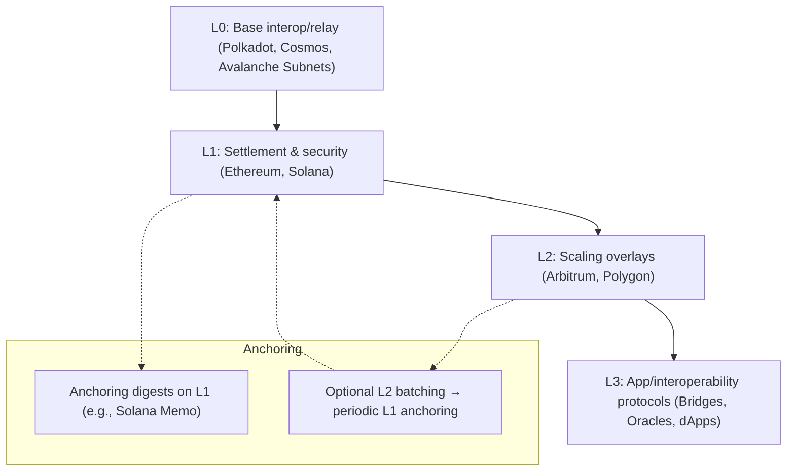

# Blockchain Integration for PhoenixRooivalk

> Public-safe overview of how a distributed ledger can harden PhoenixRooivalk
> operations. This document outlines optional patterns; it is not a commitment
> to deploy.

## Why blockchain here

- Tamper-evident audit of command, telemetry summaries, and engagement outcomes.
- Decentralized coordination primitives for swarms in contested EM environments.
- Cryptographic identity and provenance for drones, payloads, and parts.

## Application areas

### 1. Enhanced cybersecurity and data integrity

- Append-only evidence hashing of mission events (flight logs, summaries of
  sensor fusion, and operator actions) using SHA-256 and timestamping.
- Optional on-chain anchoring (posting only the content hash + metadata) to
  detect tampering without disclosing sensitive content.
- Lightweight, deferred submission via an outbox to survive link loss or rate
  limits.

See also:
[Glossary → Messaging and observability](./glossary.md#messaging-and-observability).

### 2. Secure swarm coordination and decentralized command

- Use signed messages and quorum-based tasking; optional on-chain dispute
  resolution anchors for high-value phases.
- Avoid central single points of failure; combine with fiber or LPI/LPD RF
  links.

See also:
[Glossary → Communications and EW](./glossary.md#communications-and-ew).

### 3. Authentication, tracking, and supply chain

- Per-UAS cryptographic identities; component provenance records (parts,
  firmware lineage).
- Smart-contract mediated access control (e.g., temporary keys, time-locked
  mission windows).

See also:
[Glossary → Operations and concepts](./glossary.md#operations-and-concepts).

### 4. Immutable logging and compliance assurance

- Tamper-evident logs enabling post-mission audits and ROE/SoP conformance
  checks.
- Anchors support legal discovery while keeping raw data off-chain.

### 5. Integration with emerging technologies

- AI + blockchain for autonomous marketplace behaviors (energy/data exchange
  between nodes).
- Micropayments or credits only where policy permits; otherwise use signed IOUs
  off-chain.

## Minimal implementation pattern (recommended)

- Append-only JSONL evidence log in `backend/services/evidence_log.py`:
  - Canonicalize event payload, compute SHA-256, store
    `{ts, type, sha256, payload}`
  - Return the hex digest for downstream use.
- Extend `BlockchainHandler` with `record_event_evidence(...)`:
  - Records event to evidence log and returns the content hash.
  - Optional `enqueue_anchor=True` adds an outbox job to anchor the hash
    on-chain later.

This keeps sensitive data local while still enabling tamper detection via
hashes.

## Blockchain layers (L0–L3)

> Conceptual tiers used across blockchain architectures. Useful to reason about
> where anchoring and coordination belong in our stack.



### Definitions and primary uses

- **Layer 0 (L0)**: Foundation for interconnecting blockchains (e.g., relay/hub
  models). Provides shared security and interoperability primitives; does not
  directly process app transactions. Use for cross-chain integration and shared
  resources. In our context: link allied drone telemetry networks under a common
  trust fabric during joint operations.

- **Layer 1 (L1)**: Base protocol/ledger (consensus, settlement, native token).
  Provides the primary immutability and decentralization guarantees. Use for
  tamper-proof audit trails and identity proofs. In our context: anchor mission
  evidence digests and authenticate drone identities.

- **Layer 2 (L2)**: Scaling overlays on L1 (rollups, channels, sidechains)
  batching or offloading execution then settling to L1. Use for high-throughput,
  low-cost interactions. In our context: near-real-time swarm coordination or
  rapid command signaling with periodic settlement.

- **Layer 3 (L3)**: App-specific and interoperability protocols above L1/L2
  (bridges, oracles, dApp frameworks). Use for specialized workflows and
  cross-chain services. In our context: cross-network intelligence sharing and
  automated compliance checks.

### Comparative summary (examples are illustrative)

| Layer | Definition                                         | Primary uses                                   | Example in drone ops                              |
| ----- | -------------------------------------------------- | ---------------------------------------------- | ------------------------------------------------- |
| L0    | Foundational infra for interconnecting blockchains | Cross-chain interoperability; shared resources | Integrate data across allied drone networks       |
| L1    | Base protocol for consensus and settlement         | Core security and decentralization             | Tamper-proof logging of flight paths, sensor data |
| L2    | Scaling solutions built on L1                      | High-throughput, low-cost operations           | Real-time swarm command distribution              |
| L3    | App-specific and interop protocols                 | Custom dApps and multi-chain integrations      | Cross-system compliance verification              |

See also:
[Glossary → Operations and concepts](./glossary.md#operations-and-concepts).

## Evaluation of Layer 0 (L0) blockchains and adapters

> L0s provide cross-chain interoperability and customizable networks. Useful for
> allied operations and subnet-style isolated swarms. Consider trade-offs vs
> L1/L2.

### Role of L0 in drone operations

- **Cross-chain coordination**: Combine secure logging (L1) with low-latency
  control (L1/L2) across parties.
- **Customizable subnets**: Mission-specific chains with tailored latency and
  policy.
- **Resilient infra**: Reduced single points of failure; decentralization across
  the base layer.
- **Scalable interop**: XCM/IBC-style adapters for high-throughput data exchange
  across allied networks.

Challenges:

- Cross-chain messaging may add latency.
- Bridges/adapters increase operational complexity and require strong security
  controls.

### Suitability matrix (H/M/L)

| Chain / Adapter     | Security | Scalability | Latency | Interoperability | Resilience | Efficiency |
| ------------------- | -------- | ----------- | ------- | ---------------- | ---------- | ---------- |
| Polkadot (XCM)      | H        | H           | M       | H                | H          | M          |
| Cosmos (IBC)        | M        | M           | M       | H                | M          | M          |
| Avalanche (Subnets) | H        | H           | H       | M                | H          | H          |

Notes:

- Polkadot: strong shared security and interop; XCM adds moderate latency—
  suited for audit trails and cross-force data.
- Cosmos: excellent interop; security/resilience depend on connected zones— fit
  for lower-threat or regional ops.
- Avalanche: subnets are high-perf and configurable—fit for isolated, real-time
  swarm networks.

### Comparison to L1/L2/L3

Related ADR appendix: see
[ADR 0004 — Layered strategy (Appendix)](./adr/0004-layered-strategy-l1-l2-l3.md).

#### L1 suitability matrix

L1 adapters include native bridges or basic interop to L2/L3. Best for strong
security and archival integrity; scalability can be limiting for swarms.

| Chain / Adapter example                | Security | Scalability | Latency | Interoperability | Resilience | Efficiency |
| -------------------------------------- | -------- | ----------- | ------- | ---------------- | ---------- | ---------- |
| Ethereum (with Wormhole bridge)        | H        | M           | M       | M                | H          | M          |
| Solana (with native cross-chain tools) | H        | H           | H       | M                | M          | H          |
| Bitcoin (with Lightning adapters)      | H        | L           | L       | L                | H          | L          |

Notes:

- Ethereum: robust security; moderate scalability; suitable for verifiable logs.
  Bridges enable interop but introduce bridge risk.
- Solana: ideal for low-latency anchoring/commands; resilience should be
  monitored under load or targeted conditions.
- Bitcoin: unmatched immutability for archival audit trails; not suited for
  dynamic, high-throughput coordination.

#### L2 suitability matrix

L2 adapters (rollup bridges, channels) offload execution and settle to L1.
Excellent fit for scalable, low-latency swarm coordination while inheriting L1
security.

| Chain / Adapter example             | Security | Scalability | Latency | Interoperability | Resilience | Efficiency |
| ----------------------------------- | -------- | ----------- | ------- | ---------------- | ---------- | ---------- |
| Arbitrum (with Orbit chains)        | H        | H           | H       | H                | M          | H          |
| Polygon (with AggLayer bridges)     | M        | H           | H       | H                | M          | H          |
| Optimism (with Superchain adapters) | H        | H           | M       | H                | H          | M          |

Notes:

- Arbitrum: high scalability; Orbit helps L3 app integration; strong candidate
  for high-volume reconnaissance and coordination.
- Polygon: cost-effective interop; may require L1 anchoring for elevated
  security contexts.
- Optimism: balanced resilience and interop; good for tamper-resistant drone
  identity and control where optimistic finality is acceptable.

#### L3 suitability matrix

L3 adapters interconnect multiple L1/L2 networks for cross-chain apps. Useful
for multi-network sharing, with dependencies on lower layers.

| Protocol / Adapter example  | Security | Scalability | Latency | Interoperability | Resilience | Efficiency |
| --------------------------- | -------- | ----------- | ------- | ---------------- | ---------- | ---------- |
| IBC protocol (Cosmos-based) | M        | M           | M       | H                | M          | M          |
| Quant (Overledger bridges)  | H        | M           | M       | H                | H          | M          |
| Icon (with BTP adapters)    | M        | H           | H       | H                | M          | H          |

Notes:

- IBC: strong interop across zones; overall guarantees depend on connected
  chains and relayers.
- Quant: emphasizes secure cross-chain overlays; suitable for hybrid networks
  with defense constraints.
- Icon: efficient adapters for app-specific workflows; security inherits from
  base layers and adapter assumptions.

### Recommendations

- Prioritize L0 (Avalanche subnets or Polkadot) for multi-protocol or
  multinational ops where interop is first-class.
- Use L2 for single-chain, high-speed swarm command; periodically anchor to L1
  for integrity.
- Mitigate bridge risks via multi-sig, audits, and minimized trust assumptions.

## Solana on-chain anchoring (pilot)

> Goal: fast, low-cost anchoring of evidence digests using Solana's Memo
> program.

### How it works

- The digest returned by `evidence_log.record_event(...)` is submitted to Solana
  in a transaction that includes a Memo instruction carrying the hex digest as
  memo data.
- No raw mission data is placed on-chain—only the digest (tamper-evidence).

### Configuration

- Set environment variables (runtime):
  - `EVIDENCE_ANCHOR_CHAIN=solana`
  - `SOLANA_RPC_URL` (e.g., `https://api.mainnet-beta.solana.com` or a private
    RPC)
  - `SOLANA_SECRET_KEY` (JSON array or `file://` path to a JSON array output by
    `solana-keygen`)
  - Optional: `SOLANA_COMMITMENT` = `processed|confirmed|finalized` (default:
    `confirmed`)

### Code paths

- Anchor helper: `backend/services/solana_anchor.py`
- Outbox integration: `backend/services/blockchain_handler.py` in
  `process_outbox_batch()` handles `op_type == "anchor_digest"` by calling the
  Solana anchor if `EVIDENCE_ANCHOR_CHAIN=solana`.

### Usage

```python
from backend.services.blockchain_handler import BlockchainHandler, ProviderConfig

handler = BlockchainHandler(ProviderConfig(endpoint="http://placeholder"))

# 1) Record local evidence
digest = handler.record_event_evidence(
    "engagement_summary",
    {"missionId": "M-123", "result": "success", "targets": 2},
    enqueue_anchor=True,
)

# 2) Later (worker/cron), process outbox to perform on-chain anchoring
handler.process_outbox_batch()
```

### Dependencies (Solana only)

- Install when anchoring is enabled: `pip install solana solders`
- If missing, the code logs/import-errors gracefully and treats anchoring as a
  permanent no-op until installed.

## Networks and address formats (current internal support)

- EVM family (e.g., Ethereum/Etherlink) — see
  `backend/api/blockchain/networks.py` for address validation guidance and
  examples.
- Additional networks can be added behind the same high-level handler.

## Operational cautions

- Do not place classified raw data on public chains; anchor only hashes +
  minimal metadata.
- Respect export controls and rules of engagement. Use private/permissioned
  ledgers if required.
- Account for device resource limits; use outbox + batch anchoring to control
  costs and latency.

## Next steps

- Pilot: enable evidence hashing in dev/test; evaluate anchoring cadence and
  cost.
- Expand address/network metadata as required by deployments.
- Add redaction policies to canonicalization steps if needed.
