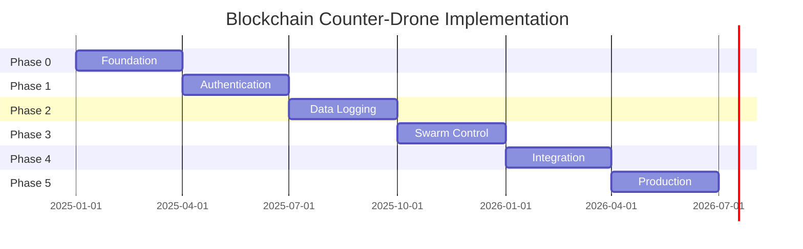

# Implementation Roadmap - Quick Reference

## 18-Month Master Timeline


## Phase 0: Foundation (Months 1-3)
Budget: $1.5M | Status: Ready to Launch

### Week-by-Week Execution
| Week | Milestone           | Deliverable           | Success Metric     |
|------|---------------------|-----------------------|--------------------|
| 1-2  | Team Formation      | Core team hired       | 100% staffing      |
| 3-4  | Technology Stack    | Platform selected     | Architecture approved |
| 5-6  | Infrastructure      | Dev environment live  | CI/CD operational  |
| 7-8  | Blockchain Network  | 5-node testnet        | <100ms latency     |
| 9-10 | PUF Integration     | Hardware procured     | Authentication demo |
| 11-12| POC Complete        | Working prototype     | Stakeholder approval |

### Critical Path Items
- Program Director hired (Week 1)
- AWS/Azure accounts provisioned (Week 2)
- Hyperledger Fabric deployed (Week 4)
- PUF hardware ordered (Week 3)
- Security audit scheduled (Week 10)

## Phase 1: Authentication (Months 4-6)
Budget: $1.42M | Target: 99% accuracy, <2ms latency

### Key Deliverables
- Month 4: PUF-blockchain integration complete
- Month 5: 10-drone authentication testing
- Month 6: Security certification achieved

### Success Criteria
```yaml
performance:
  authentication_accuracy: ">99%"
  latency_p95: "<2ms"
  false_positive_rate: "<3%"
  concurrent_operations: ">100/sec"
  
security:
  penetration_test: "passed"
  FIPS_compliance: "achieved"
  audit_trail: "immutable"
```

## Phase 2: Data Logging (Months 7-9)
Budget: $2.524M | Target: 99.3% data integrity

### Implementation Priorities
- Month 7: Blockchain logging infrastructure
- Month 8: AI anomaly detection integration
- Month 9: Threat intelligence correlation

### Technical Milestones
- IPFS integration for large objects
- 1,000 TPS sustained throughput
- Sub-second threat detection
- 99.3% data integrity verified
- Federated learning operational

## Phase 3: Swarm Coordination (Months 10-12)
Budget: $1.27M | Target: 100-drone swarms

### Capability Build-Out
| Month | Capability         | Drones | Success Metric      |
|-------|--------------------|--------|---------------------|
| 10    | Basic Formation    | 20     | V-shape maintained  |
| 11    | Dynamic Coordination| 50    | <250ms consensus    |
| 12    | Contested Ops      | 100    | 95% jamming resistance |

### Algorithm Implementation
- DTPBFT consensus protocol
- Formation control (line, V, circle, grid, sphere)
- Byzantine fault tolerance (33%)
- Autonomous decision matrix

## Phase 4: System Integration (Months 13-15)
Budget: $1.075M | Target: 3+ vendor systems

### Integration Schedule
- Month 13: Core Integrations
  - Dedrone (RF detection)
  - Raytheon FS-LIDS (radar)
  - Echodyne MESA (3D tracking)
- Month 14: Advanced Correlation
  - Multi-sensor fusion
  - Threat correlation engine
  - Chainlink oracles
- Month 15: Automation
  - Response orchestration
  - Smart contract triggers
  - Compliance validation

## Phase 5: Production (Months 16-18)
Budget: $1.2M | Target: Full Operational Capability

### Production Readiness Checklist
- 200-drone swarm demonstrated
- 99.9% system availability
- Military compliance certified
- Operator training complete
- Disaster recovery tested
- Documentation finalized

### Go-Live Timeline
| Month 16          | Month 17          | Month 18          |
|-------------------|-------------------|-------------------|
| Beta deployment   | Production pilot  | Full launch       |
| 3 test sites      | 10 sites          | 50+ sites         |
| 1,000 flight hours| 5,000 hours       | Continuous ops    |

## Critical Decision Gates
- **Gate 1: Technology Validation (Month 3)**
  - Criteria: Latency <2ms, throughput >100 TPS, cost <$10M
  - Go Decision: Proceed to Phase 1
  - No-Go: Pivot technology stack
- **Gate 2: Security Certification (Month 6)**
  - Criteria: 99% authentication, passed penetration test, <3% false positives
  - Go Decision: Scale to production
  - No-Go: Remediate vulnerabilities
- **Gate 3: Operational Readiness (Month 12)**
  - Criteria: 50+ drone swarms, >99% availability, 3+ integrations
  - Go Decision: Full deployment
  - No-Go: Extended beta
- **Gate 4: Market Launch (Month 18)**
  - Criteria: 99.9% stability, 3+ reference customers, regulatory approval
  - Go Decision: Commercial launch
  - No-Go: Controlled rollout

## Resource Allocation

### Staffing Plan
- Month 1-3:   10 FTE (Foundation team)
- Month 4-6:   18 FTE (+ Authentication specialists)
- Month 7-9:   22 FTE (+ AI/ML engineers)
- Month 10-12: 26 FTE (+ Swarm experts)
- Month 13-15: 26 FTE (Stable team)
- Month 16-18: 30 FTE (+ Operations)

### Budget Burn Rate
- Q1 2025: $500K/month
- Q2 2025: $473K/month
- Q3 2025: $841K/month
- Q4 2025: $423K/month
- Q1 2026: $358K/month
- Q2 2026: $400K/month

## Risk Mitigation Schedule

| Phase | Primary Risk      | Mitigation Action       | Contingency           |
|------:|--------------------|-------------------------|-----------------------|
| 0     | Team formation     | Premium compensation    | Contractor augmentation |
| 1     | PUF integration    | Early vendor engagement | Alternative hardware  |
| 2     | Scalability        | Sharding implementation | Cloud scaling         |
| 3     | Swarm complexity   | Simulation testing      | Reduced drone count   |
| 4     | Vendor lock-in     | Open standards          | Custom adapters       |
| 5     | Production stability| Extensive testing       | Phased rollout        |

## Quick Win Milestones
- Month 2: First blockchain transaction
- Month 4: Live drone authentication demo
- Month 6: Military stakeholder demonstration
- Month 9: AI threat detection showcase
- Month 12: 100-drone swarm video
- Month 15: Multi-vendor integration demo
- Month 18: Commercial launch event

## Parallel Workstreams

### Continuous Activities (Months 1-18)
- Security audits (quarterly)
- Regulatory engagement (monthly)
- Patent filings (as needed)
- Partnership development (ongoing)
- Market intelligence (weekly)
- Competitive analysis (monthly)

## Accelerated Paths Available
- Solana POC: Months 1-4 (isolated, $500K)
- Quantum resistance: Start Month 7 (not Month 13)
- NATO certification: Parallel track from Month 6

## Success Metrics Dashboard

| Metric               | Month 6 | Month 12 | Month 18 |
|----------------------|---------|----------|----------|
| Technical Readiness  | 40%     | 75%      | 100%     |
| Market Validation    | POC     | Beta     | Production |
| Team Size            | 18      | 26       | 30       |
| Patents Filed        | 2       | 5        | 8        |
| Integration Partners | 1       | 5        | 10+      |
| Customer Pipeline    | $5M     | $20M     | $50M     |

---
This roadmap represents the critical path to market. Deviations require executive approval.

Document Version: 2.0.0  
Update Frequency: Weekly  
Next Review: [Week End Date]
